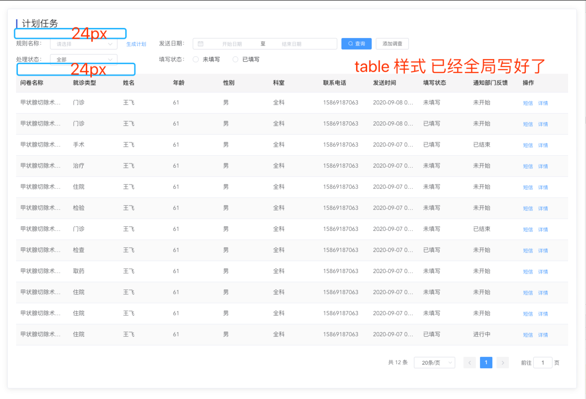
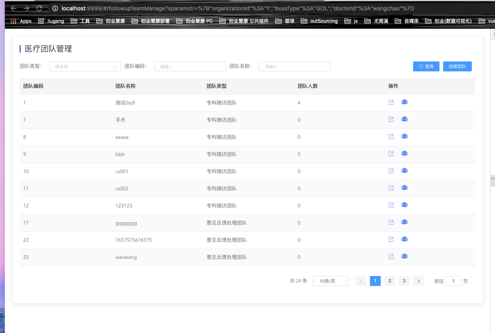
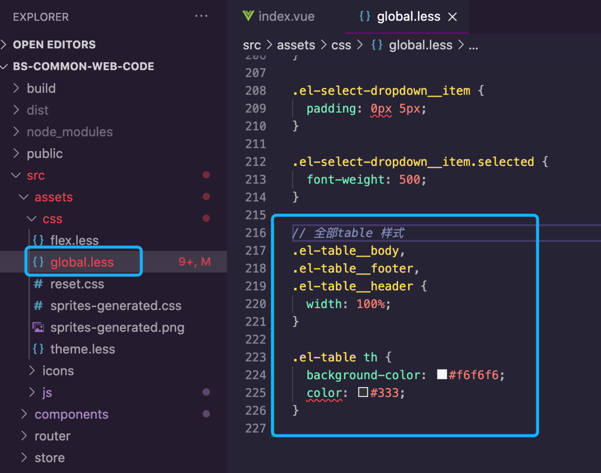

* ## 文档修订记录
| 序号 |  修改时间  | 修改人 |  版本  | 备注 |
|:----:|:----------:|:------:|:------:|:----:|
|  1   | 2020.09.10 |  刘刚  | V1.0.0 | 初稿 |

* ## 一、table规范
### 采用统一table布局，尽可能达到样式统一，提升用户体验。

```ts
<template>
  <div class="pd20">
    <el-card class="box-card">
      <div class="common-title">
        <div class="inner">xxx</div>
      </div>

      <el-form :inline="true" :model="params" size="mini">
       ...
      </el-form>

      <el-table
        :data="tableData"
        stripe
      >
        ...
        <el-table-column label="xxxx" prop="xxxx" show-overflow-tooltip></el-table-column>
        ...
      </el-table>
      <div class="text-right">
        <BsPagination
          v-show="total>0"
          :total="total"
          :page.sync="params.pageNo"
          :limit.sync="params.pageSize"
          @pagination="getListData"
        />
      </div>
    </el-card>
  </div>
</template>

```

实际效果图：





全局table样式放在：


