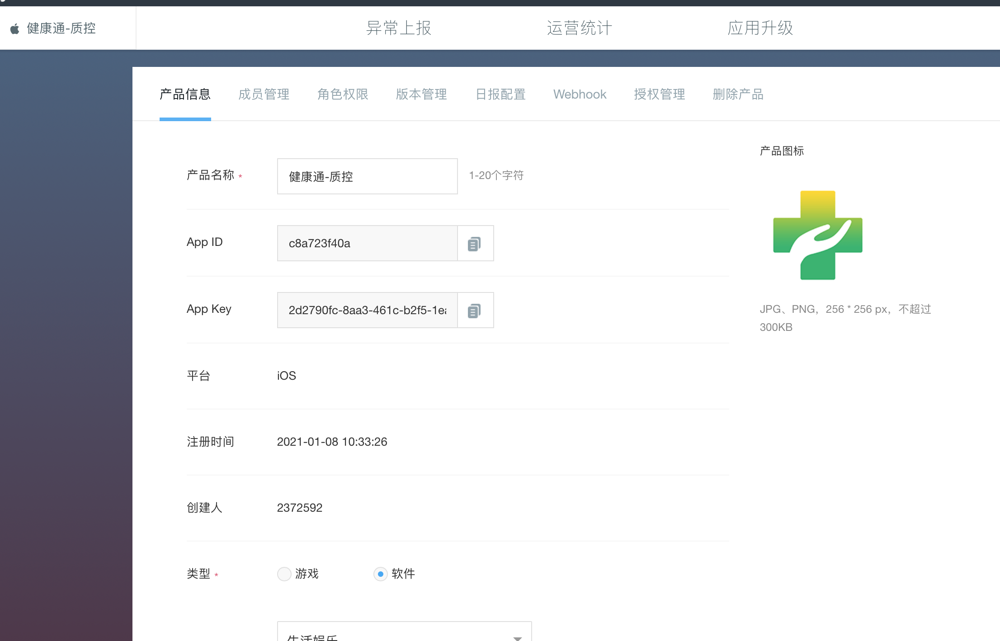
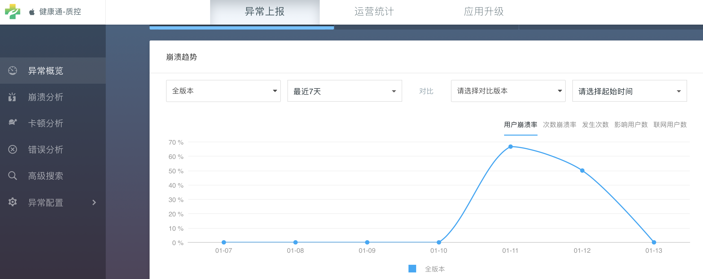
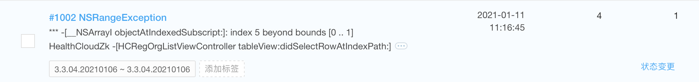
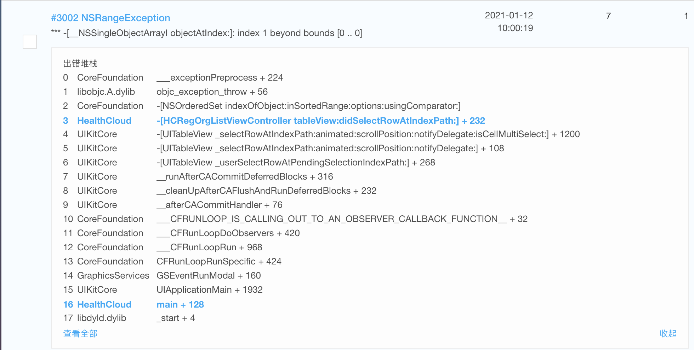
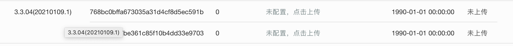
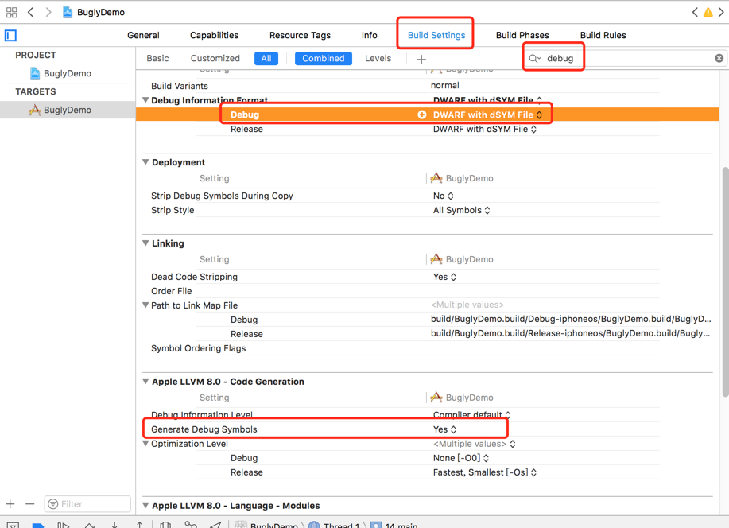
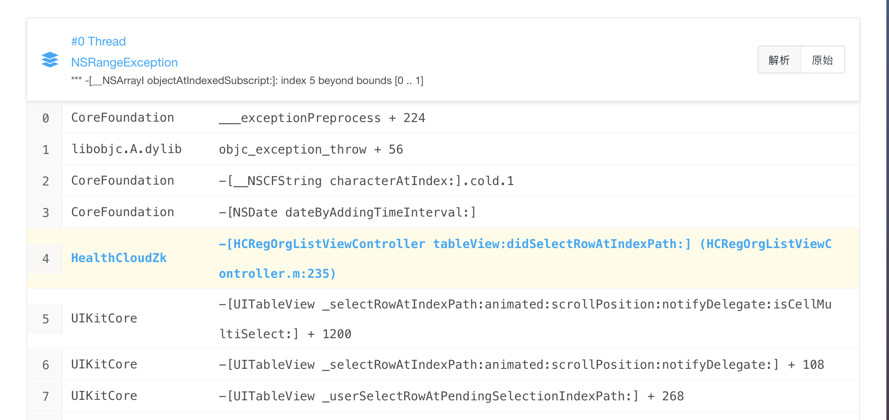
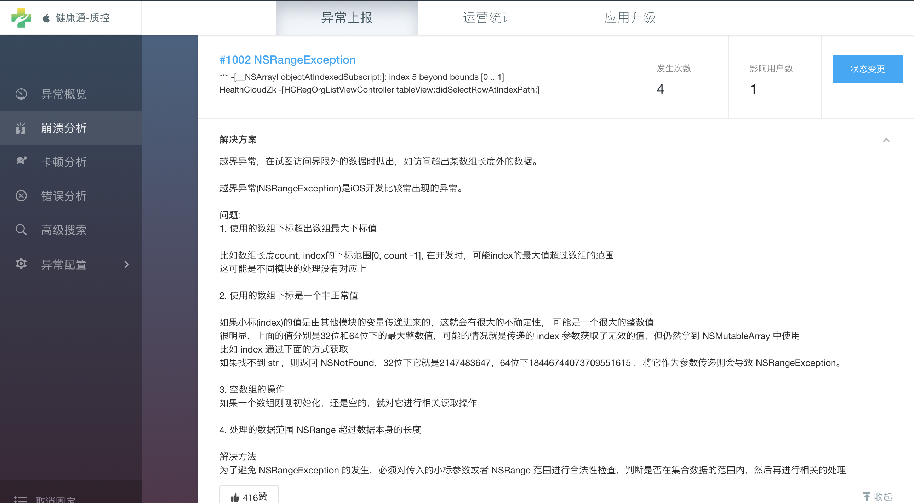

# Bugly

## Bugly账号注册

1、按照官方文档注册登录
2、新建产品，注册基本信息


## Bugly接入 （文档https://bugly.qq.com/docs/user-guide/instruction-manual-ios）
1、Bugly提供两种集成方式供iOS开发者选择：
  1.1通过CocoaPods集成
  在工程的Podfile里面添加以下代码：
  ```ruby
  pod 'Bugly'
  ```
  保存并执行pod install,然后用后缀为.xcworkspace的文件打开工程.
  1.2手动集成
  下载 Bugly iOS SDK
  拖拽Bugly.framework文件到Xcode工程内(请勾选Copy items if needed选项)
  添加依赖库
  SystemConfiguration.framework
  Security.framework
  libz.dylib 或 libz.tbd
  libc++.dylib 或 libc++.tbd
2、然后在AppDelegate中初始化
在工程的AppDelegate.m文件导入头文件
```ruby
#import <Bugly/Bugly.h>
- (BOOL)application:(UIApplication *)application didFinishLaunchingWithOptions:(NSDictionary *)launchOptions {
[Bugly startWithAppId:@"c8a723f40a" developmentDevice:YES config:^{
        BuglyConfig *config = [[BuglyConfig alloc] init];
        config.blockMonitorEnable = YES;
        config.blockMonitorTimeout = 2;
        config.consolelogEnable = YES;
        config.delegate = self;
        config.reportLogLevel = BuglyLogLevelWarn;
        return config;
}()];
}
```
通过以上的集成及初始化，我们就可以使用了。现在我们创造一个闪退bug，测试下Bugly的bug上传及时性。

在touchBegin中制造一个闪退。然后刷新Bugly的控制台，你会发现，bug已经统计到了。


我们点进异常问题中去看一下，崩溃信息大致是这样的，相较于友盟的分析，我们可以很直观的看到崩在哪个方法里了，但想更具体的分析代码位置，就要用到符号表了。




没有符号表，我们就无法定位崩溃中的符号对应的代码所在的类以及类中的行数位置。我们在每次构建版本、debug的时候，都会生成dSYM后缀名的符号表文件，而我们App在手机上运行的时候，崩溃后产生的崩溃信息，不可能定位到代码的多少多少行，因为这些信息对于App运行是没有意义的，存储在App中势必会增大安装包的体积，所以App的崩溃信息都是存储为各种符号，具体符号代表什么，需要去符号表中查找对应的含义。

我们每次debug、构建版本，都会生成dSYM文件，都对应了一个UUID（像我们的手机一样，都有一个唯一标志），按下图指示，我们就能找到我们所使用的App版本对应的dSYM文件的UUID，通过这个UUID，我们就能找到存储在我们电脑中的dSYM文件，将这个文件上传到bugly，bugly会自动帮我们找到崩溃符号的含义。


需要注意的是，构建版本会自动生成dSYM文件，但debug的时候，是没有的，需要我们手动开启。在build setting中搜索debug，将下面两项内容修改为正确的设置：


打开文件路径，就找到了dSYM文件：
拷贝出来，压缩为zip文件，上传到bugly上。
刷新页面，再回去看刚才的问题，定位到了为HCRegOrgListViewController.m的第235行：



