<Boxx  changeTime="5000"/>  

## 一. 原理
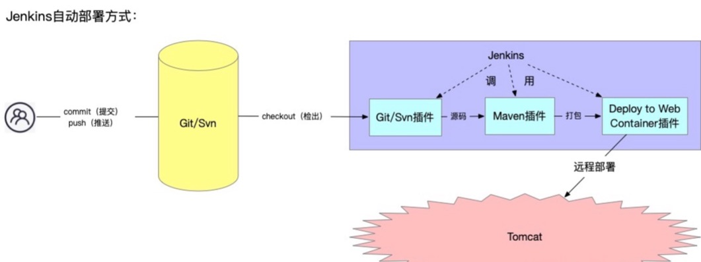

## 二. 部署方式
1、jenkins触发式构建：
用于开发环境部署，开发人员push代码或者合并代码到gitlab项目的指定分支，jenkins就部署代码到对应服务器。

2、jenkins参数化构建：
用于测试环境预上线环境部署，开发push代码或者合并代码到gitlab项目的指定分支之后，并不会部署代码，而是需要登录到jenkins的web界面，点击构建按钮，传入对应的参数（比如参数需要构建的tag，需要部署的分支）然后才会部署。

3、jenkins定时构建：
用于自动打包，定时构建是在参数化构建的基础上添加的，开发人员可以登录jenkins手动传入tag进行打包，如果不手动打包，那么jenkins就每天凌晨从gitlab拉取最新的代码打包。

## 三. 项目配置
* 1、登入jenkins的web界面，选择相应目录新建任务

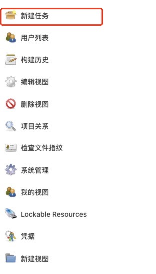

* 2、输入任务名称（一般以项目名命名，后缀-dist：是参数化构建方式，-auto：定时构建方式），选择任务模式

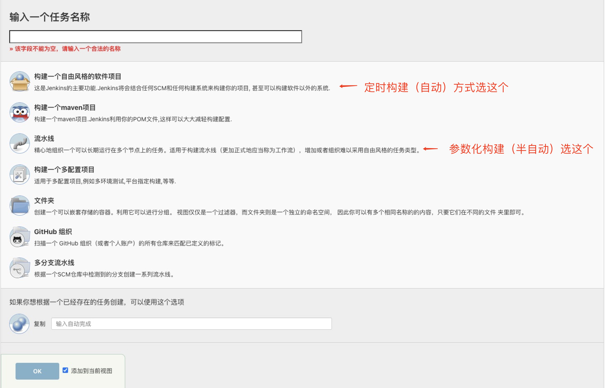

* 3-1、参数化构建配置
* 任务描述

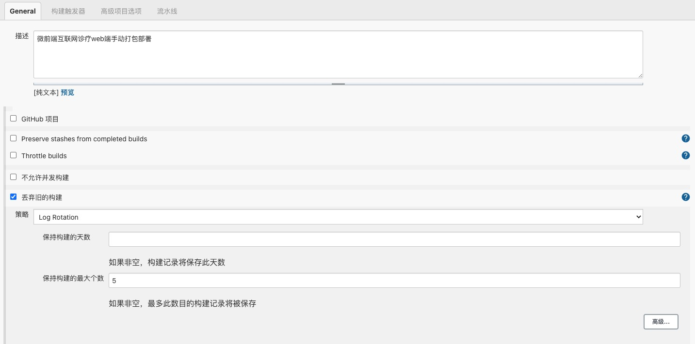

* 参数配置

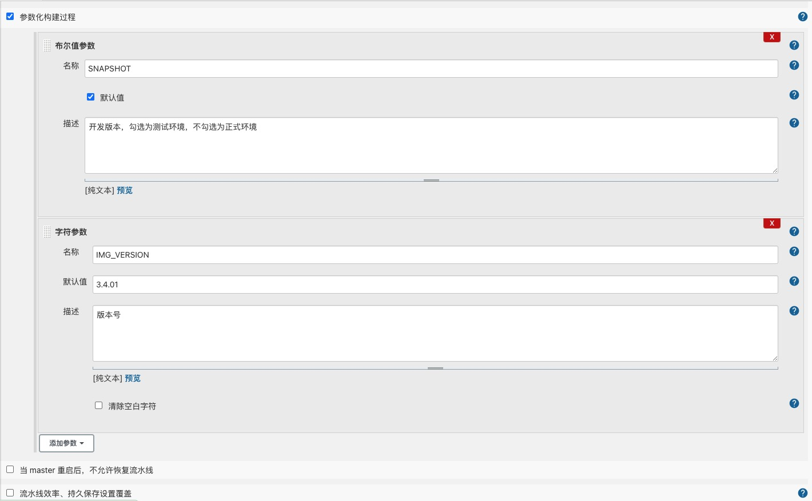

* 流水线配置(dist源码git地址以及分支选择)

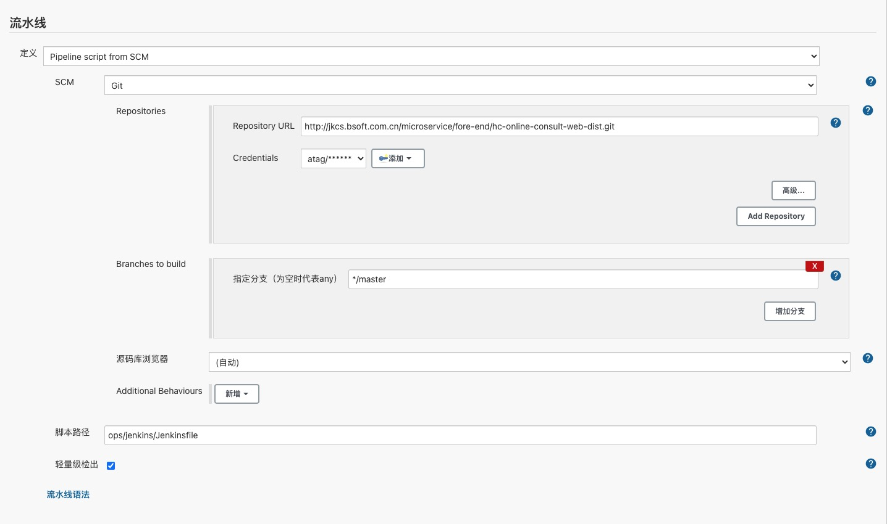

加深理解参考文章：https://blog.51cto.com/u_12965094/2739656

* 3-2、定时构建配置
* 任务描述

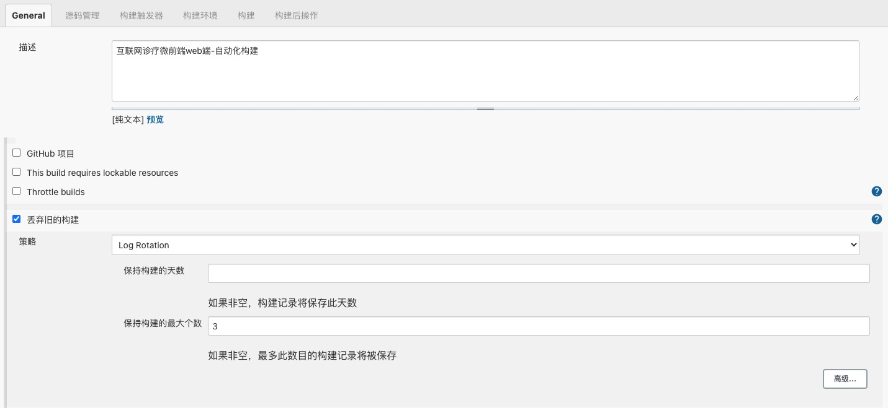

* 参数配置

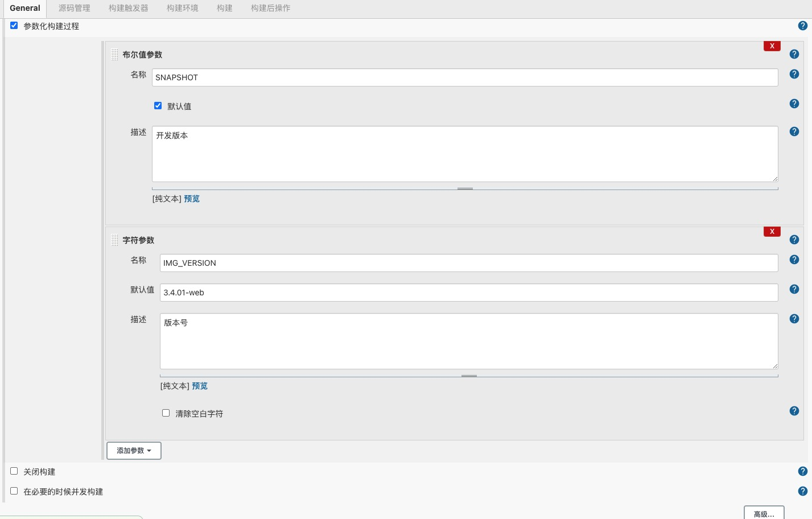

* 源码管理(源码git地址以及分支选择)

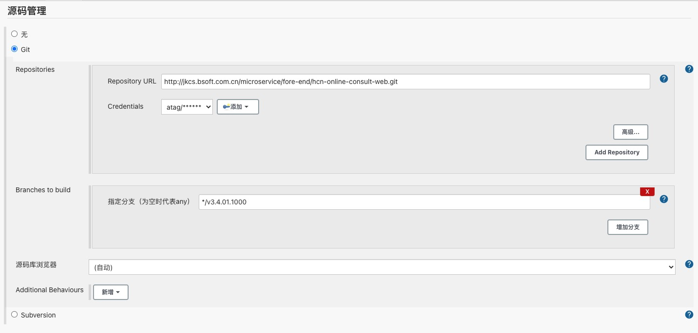

* 定时构建配置

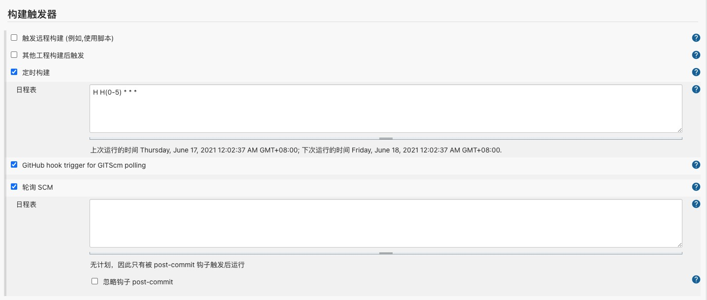

* 构建环境选择（前端选择node环境）

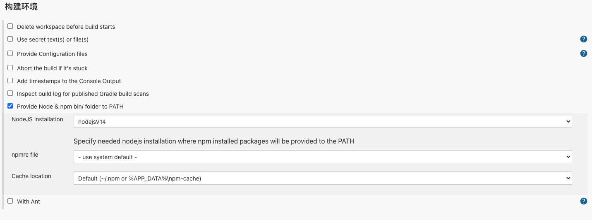

* 执行脚本

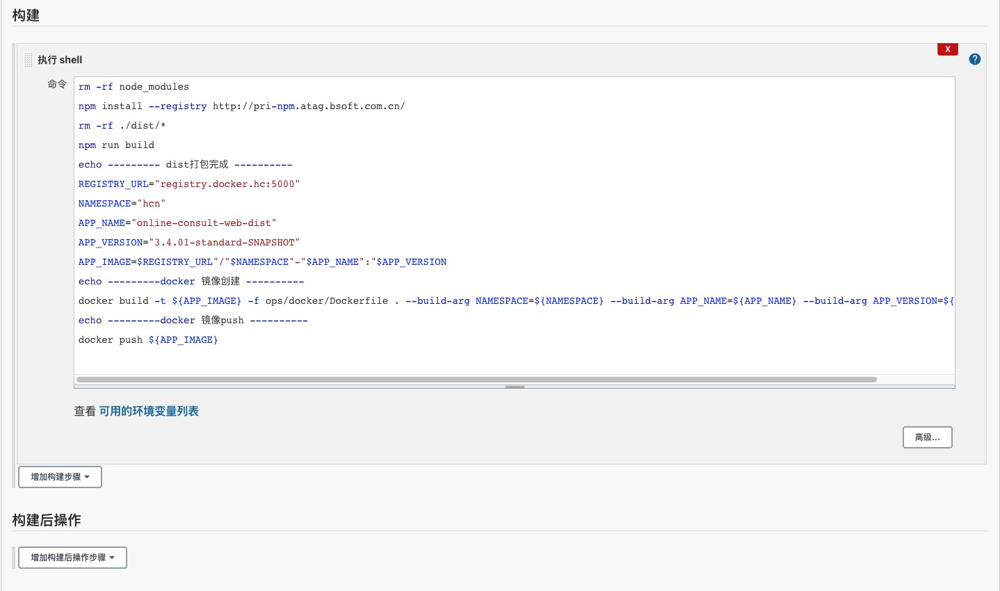

