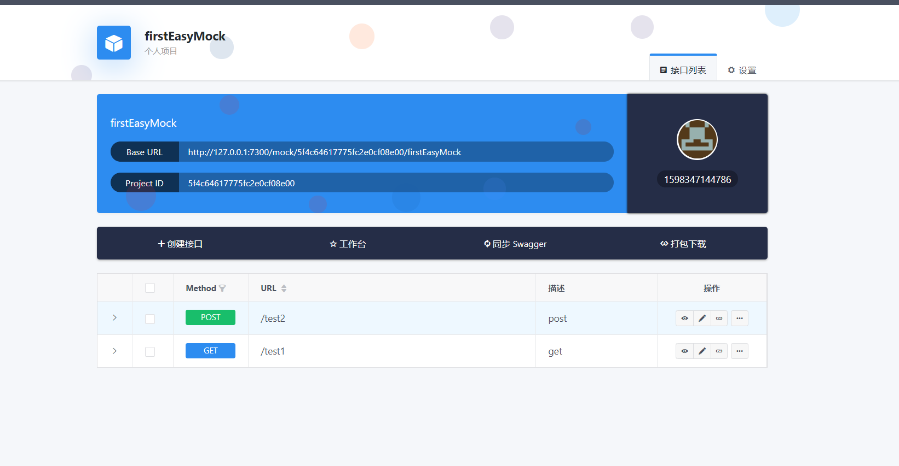
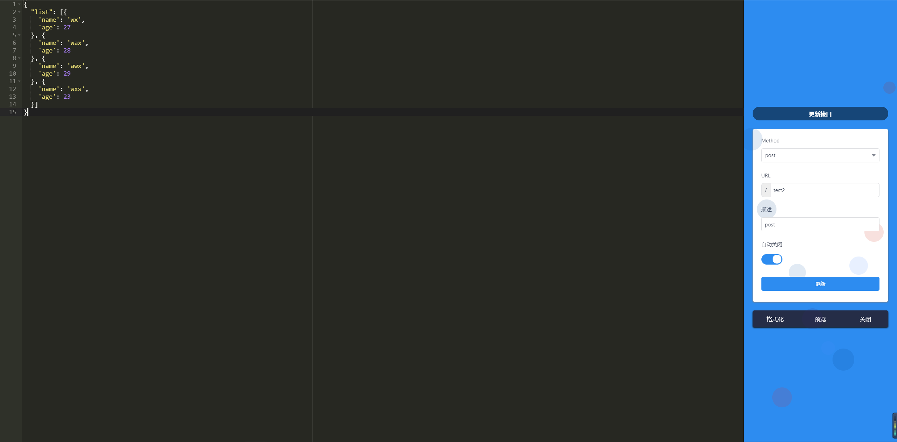

## 1为什么要使用mock数据
*  团队可以并行工作
有了Mock，前后端人员只需要定义好接口文档就可以开始并行工作，互不影响，只在最后的联调阶段往来密切；后端与后端之间如果有接口耦合，也同样能被Mock解决；测试过程中如果遇到依赖接口没有准备好，同样可以借助Mock；不会出现一个团队等待另一个团队的情况。这样的话，开发自测阶段就可以及早开展，从而发现缺陷的时机也提前了，有利于整个产品质量以及进度的保证。

*  开启TDD模式，即测试驱动开发
单元测试是TDD实现的基石，而TDD经常会碰到协同模块尚未开发完成的情况，但是有了mock，这些一切都不是问题。当接口定义好后，测试人员就可以创建一个Mock，把接口添加到自动化测试环境，提前创建测试。

*  可以模拟那些无法访问的资源
比如说，你需要调用一个“墙”外的资源来方便自己调试，就可以自己Mock一个。

*  隔离系统
假如我们需要调用一个post请求，为了获得某个响应，来看当前系统是否能正确处理返回的“响应”，但是这个post请求会造成数据库中数据的污染，那么就可以充分利用Mock，构造一个虚拟的post请求，我们给他指定返回就好了

*  可以用来演示
假如我们需要创建一个演示程序，并且做了简单的UI，那么在完全没有开发后端服务的情况下，也可以进行演示。说到演示了，假如你已经做好了一个系统，并且需要给客户进行演示，但是里面有些真实数据并不想让用户看到，那么同样，你可以用Mock接口把这些敏感信息接口全部替换。

*  测试覆盖度
假如有一个接口，有100个不同类型的返回，我们需要测试它在不同返回下，系统是否能够正常响应，但是有些返回在正常情况下基本不会发生，难道你要千方百计地给系统做各种手脚让他返回以便测试吗？比如，我们需要测试在当接口发生500错误的时候，app是否崩溃，别告诉我你一定要给服务端代码做些手脚让他返回500 。。。而使用mock，这一切就都好办了，想要什么返回就模拟什么返回，妈妈再也不用担心我的测试覆盖度了

## 2如何mock数据

1.	安装mockjs

通过如下命令安装mockjs
```
npm i mockjs/yarn add mockjs
```

2.	引入mockjs

通过nodejs 引入：
```
let mock = require('mockjs');
```
通过import 引入：
```
import Mock from 'mockjs';
```

3.	使用mock数据模板模拟数据
``` javascript
Mock.mock({
    'status': 200,
    'dataSource|1-9': [{
    'key|+1': 1,
    'mockTitle|1': ['肆无忌惮'],
    'mockContent|1': ['角色精湛主题略荒诞', '理由太短 是让人不安', '疑信参半 却无比期盼', '你的 圆满', '别让纠缠 显得 孤单'],
    'mockAction|1': ['下载', '试听', '喜欢']
    }]
  })
``` 
4.	mock数据模板规则

数据模板中的每个属性由 3 部分构成：属性名、生成规则、属性值,如下格式：

// 属性名   name, 生成规则 rule, 属性值   value
// 'name|rule': value

注意：
属性名 和 生成规则 之间用竖线 | 分隔。
生成规则 是可选的。
生成规则 有 7 种格式，如下：
```
1.'name|min-max': value

2.'name|count': value

3.'name|min-max.dmin-dmax': value

4.'name|min-max.dcount': value

5.'name|count.dmin-dmax': value

6.'name|count.dcount': value

7.'name|+step': value
```
详情请跳转知乎https://zhuanlan.zhihu.com/p/48467375


## 3 前端使用mock数据的三种方式

1．	本地mock数据  
本地mock数据的方式就是仅使用mock的数据模板规则生成所需要的前端数据，不涉及接口和请求，如下所示：
``` javascript
//本地mock数据，无接口
getLocalMock() {
  let data = this.$mock(this.$mkData.testLocal1);
  this.mockData1 = JSON.stringify(data);
}, 

testLocal1: {
  status: 200,
  message: "",
  //属性cartList的值是一个数组，其中包含3个元素
  "cartList|3": [
    {
      //shopTitle数组按照顺序每次显示下面的一个元素
      "shopTitle|+1": ["寻找田野", "猫咪森林", "老爹果园"],
      //属性shopId是一个Number类型的值，是10000-99999中的一个随机数
      "shopId|10000-99999": 1,
      //属性img是一个字符串类型的，生成的图片是90*90，颜色随机的
      img: "@image(90*90,@color)",
    },
  ],
},

```
2.本地服务mock数据  
本地服务mock数据就是通过nodejs在本地启动一个简单的本地服务，并且引入mockjs，实现简单的接口请求和模拟数据返回，如下所示：
``` javascript
//启动本地服务mock数据，get请求
getDataTestGet() {
  this.$httpGet(this.$inface.test2).then((res) => {
    if (res.status == 200) {
      this.mockData2 = JSON.stringify(res);
    }
  });
},

--mockServer.js    

let express = require('express');   //引入express
let Mock = require('mockjs');       //引入mock

let app = express();        //实例化express

app.use('/test/data1', function (req, res) {
  res.header("Access-Control-Allow-Origin", "*");
  res.header('Access-Control-Allow-Methods', 'PUT, GET, POST, DELETE, OPTIONS');
  res.header("Access-Control-Allow-Headers", "X-Requested-With");
  res.header('Access-Control-Allow-Headers', 'Content-Type');
  res.json(Mock.mock({
    'code': 200,
    'data|1-9': [{
      'key|+1': 1,
      'name|1': ['wx', 'zs', 'ls'],
      'age|1': [28, 36, 78, 56, 3, 71],
      'discription|1': ['长得漂亮', '不错', '忠厚老实', '无脑']
    }]
  }))
})

app.listen('8090', () => {
  console.log('监听端口 8090')
})

--packag.json 
"scripts": {
  "dev": "webpack-dev-server --inline --progress --config build/webpack.dev.conf.js",
  "mock": "node ./mock/mockServer"
},

```
3.使用目前已有的开源框架来实现mock数据，这里我采用的是easyMock，如下所示：
``` javascript
//easyMock post请求
getTestEasyMockPost() {
  const params = {
    mpiId: "123456",
    bussType: "HOL",
    userType: "1",
  };
  this.$httpPost(this.$inface.test5, params).then((res) => {
    if (res.status == 200) {
      this.mockData5 = JSON.stringify(res.data.list);
    }
  });
},
```
easyMock 接口管理可视化界面



easyMock 接口编辑可视化界面



## 4三种mock数据的优缺点
第一种：
优点：简单快捷 
缺点：仅限开发人员使用，没有涉及到接口，无法做到并行开发

第二种：
优点：简单快捷，可以做接口测试，可做并行开发
缺点：仅限开发人员使用，接口不易维护

第三种：
优点：可做接口测试，并行开发，易于维护，不仅限于开发人员使用
缺点：需要单独部署项目，需要安装mongdb,redis等工具
