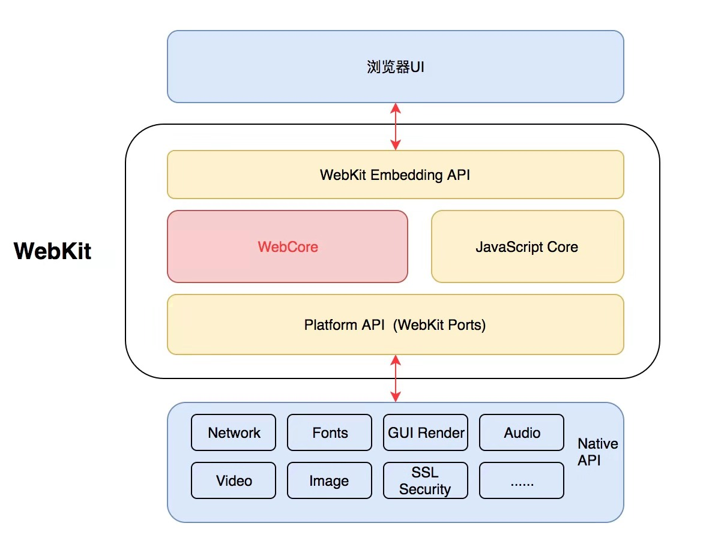

<Boxx  changeTime="5000"/>  

## 背景

本文正式开篇讲实现原理之前，我想先简单说明一下小程序领域的现状，以及 EMP 框架研究方向的出发点和个人思考。目前基于统一的 DSL (Vue/React/自定义DSL) 转换到各家的小程序的框架一大堆，比如 mpvue、uni-app、Taro 等，这些框架解决的核心问题是实现一套开发代码编译到多端小程序。

如果我们想从零开始做一个类似微信小程序的引擎，或者将微信小程序现有资源转换成 H5 容器、App 容器能够运行的资源，那么和一套 DSL 编译到各个平台的思路是恰好相反的。我们需要搞清楚小程序在小程序引擎是怎么跑起来的，各家小程序引擎实现机制不太一样，但是基本上都是参考微信小程序引擎做的实现，保留了小程序的双线程模型。各小程序平台的基础库是不一样的，微信小程序开发框架是 mina 框架，百度小程序小程序开发框架是 swan 框架，视图层都有一套自己实现的 mvvm 框架，逻辑层就相对比较一致，都是 JavaScript 引擎，无非是基于 V8 或 JavaScriptCore。

目前小程序相关的框架可以分成以下大类：

- 统一的 DSL 编译到多平台小程序、H5、App，实现应用跨多端运行，典型的框架：[mpvue](https://github.com/Meituan-Dianping/mpvue)、[uni-app](https://github.com/dcloudio/uni-app)、[Mars](https://github.com/max-team/Mars)、[Taro](https://github.com/NervJS/taro)、[Nanachi](https://rubylouvre.github.io/nanachi/index.html)、[Chameleon](https://github.com/didi/chameleon)；
- 多平台小程序之间互相转换，实现小程序之间跨端运行，典型的框架：[Antmove](https://ant-move.github.io/website/)、[wx2swan](https://smartprogram.baidu.com/docs/develop/tutorial/move)、[@qihoo/wx2qh](https://www.npmjs.com/package/@qihoo/wx2qh)；
- 小程序编译到 Web、App 端运行，实现小程序资源的复用，典型的框架：[wept](https://github.com/chemzqm/wept)、[weweb](https://github.com/wdfe/weweb)、[Hera](https://github.com/weidian-inc/hera)；
- 类微信小程序的小程序引擎框架，典型的框架：[swan-js](https://github.com/swan-team/swan-js)、[Hera](https://github.com/weidian-inc/hera)、[OpenApp+](http://openapplus.com/)、[HybridFlutter](https://github.com/githubliruiyuan/HybridFlutter)、[flutter-mini-program](https://github.com/zhaomenghuan/flutter-mini-program)。


小程序引擎可以参考的资料和内容比较少，目前可以借鉴的思路有两种：

- 参考微信小程序的实现，反编译微信开发者工具和基础库，基于 Hera 进行二次开发，将 Hera 中微信小程序开发框架 mina 框架(组件系统 [exparser](https://www.npmjs.com/package/miniprogram-exparser)、vdom 等) 换成 Vue.js 框架等成熟的前端框架，引入组件系统开发类微信规范的小程序组件；
- 参考百度小程序的实现，目前百度小程序前端核心框架 swan-js 开源，也可以考虑基于 swan 进行改造，比如有人将其中的 mvvm [san](https://baidu.github.io/san) 框架换成了 Vue 框架，[swanvue-core](https://github.com/handsomeliuyang/swanvue-core)，然后去实现宿主容器。

EMP 出发点来源于构建自定义小程序引擎时，尝试基于 Vue.js 框架作为视图层底层框架，然后组件标准和逻辑层模仿微信小程序，目前已经初步实现了简单的一个小程序容器。如果以 Vue 作为初始 DSL 直接开发小程序也不是不可以，但是小程序生态现有的资源无非直接复用，能不能将小程序转换成 Vue.js 框架能运行的代码呢，这就是 EMP 框架最初的起点，定位是一种小程序引擎的实现，保留小程序双线程模型，基于 Vue.js 框架实现视图层渲染容器，使用 JavaScript 引擎实现小程序逻辑层调用。

## 小程序 & Native & Web

从 PC 时代开始，Native 与 Web 就一直是相互竞争、相互融合的关系，我们先来简单看看它们之间的优势与劣势。

|          |           Native           |           Web           |
|:--------:|:--------------------------:|:-----------------------:|
|   性能   |             高             |           低            |
| 用户体验 |             好             |    白屏、交互反馈差     |
|   功能   | 可以充分利用平台自身的能力 | 只有使用 W3C 的标准能力 |
|   迭代   |      周期长，需要发布      |    周期短，随时发布     |
| 维护成本 |             高             |           低            |
|  跨平台  |             差             |           好            |
|   线程   |           多线程           |         单线程          |

可以看出，Native 与 Web 之间各有优劣，在移动互联网发展的过程中，开发者们也一直在寻找融合双方优势的方案，经历了以下四个阶段的发展：

- Hybrid 1.0：为 Web 页面提供 Naive API 的能力，也就是用 JS Bridge 去增强系统的 WebView 的功能。缺点是：体验差，如滚动、动画与交互等，稳定性差，如列表内存占用大等。
- Hybrid 2.0：将 Native 组件覆盖在 WebView 之上，例如微信的 cover-view，提供更多的扩展能力。缺点是：用户体验融合性不好，如层级、事件、布局等。
- Hybrid 3.0：前端 DSL 开发，Native 渲染，例如 React Native 与 Weex。缺点：对 W3C 标准能力支持有限，存在平台差异，三端并不完全统一。
- Hybrid 4.0：百花齐放的小程序、快应用、轻应用方案，这个容器也有两种：WebView 容器与类 ReatNative 容器。技术方案上并没有太多的花样，这种方案的兴起由微信带起，本质上还是源于各大公司对于流量入口和生态的竞争。

小程序的特点：

- 使用 WebView 开发，门槛低，可云端更新。
- 通过提供基础能力、原生组件结合等方式，提升用户体验。
- 通过平台发布、审核、下架、封禁等能力，具备对小程序的管控能力。
- 双线程（逻辑层和渲染层分开），隔离 DOM、BOM 能力，提升体验的同时，可保证 WebView 安全性。

小程序性能优化：

- 安装包缓存
- 分包加载
- 独立渲染线程
- webview 预加载
- Native 组件

可以看出来小程序是介于 Nativa 与 Web 两者间的应用形态，下面我们会从 Native 与 Web 两个不同的角度的看一下小程序的设计原理。

## 重新认识浏览器内核

在研究小程序引擎运行原理之前，我们需要对浏览器内核有一些基本认识，这样我们可以更好的理解小程序的设计思路。

### Browser engine

浏览器内核，浏览器引擎(Browser engine)，也称排版引擎(layout engine)、页面渲染引擎(rendering engine)。浏览器内核无非需要以下几个主要部分，如 HTML/CSS 解析器，网络处理，JavaScript 引擎，2D/3D 图形引擎，多媒体支持等。

|  内核   |                                浏览器                                 | 发布年份 | 发布厂商  | 维护状态 | JavaScript 引擎 |
|:-------:|:---------------------------------------------------------------------:|:--------:|:---------:|:--------:|:---------------:|
| Trident |                        IE4 - IE11、360 浏览器                         |   1997   | Microsoft |   停止   | JScript/Chakra  |
|  Gecko  |                                Firefox                                |   2004   | Netscape  |   维护   |  SpiderMonkey   |
| WebKit  | Safari、Chromium、Chrome(-2013)、Android 浏览器、Chrome OS、Web OS 等 |   2005   |   Apple   |   维护   | JavascriptCore  |
|  Blink  |                         Chrome(2013-)、 Opera                         |   2013   |  Google   |   维护   |       V8        |
|  Edge   |                                 Edge                                  |   2015   | Microsoft |   停止   |     Chakra      |

### JavaScript Engine

目前在 Android／iOS 上运行 JavaScript，主要有两种方法：一种方法是利用系统的浏览器组件 WebView（Android）和 UIWebView／WKWebView（iOS）；另一种方法是编译和集成一个功能全面的 JavaScript 引擎。JavaScript 引擎是一个专门处理 JavaScript 脚本的虚拟机，一般会附带在网页浏览器之中。

| JavaScript Engine |       Android       |               iOS               |  维护厂商/个人  |
|:-----------------:|:-------------------:|:-------------------------------:|:---------------:|
|        V8         |         JIT         | JIT only for jailbroken devices |     Google      |
|  JavaScriptCore   | Interpreter and JIT |        Interpreter only         |      Apple      |
|   SpiderMonkey    | Interpreter and JIT |        Interpreter only         |     Mozilla     |
|       Rhino       |     Interpreter     |           Unsupported           |     Mozilla     |
|      quickjs      |          -          |                -                | Fabrice Bellard |

### How WebKit works

WebKit 工作原理可以看 [How WebKit works](https://docs.google.com/presentation/d/1ZRIQbUKw9Tf077odCh66OrrwRIVNLvI_nhLm2Gi__F0/pub?slide=id.p) 详细介绍。



WebKit 就是一个页面渲染以及逻辑处理引擎，前端工程师把 HTML、JavaScript、CSS 这“三驾马车”作为输入，经过 WebKit 的处理，就输出成了我们能看到以及操作的 Web 页面。从上图我们可以看出来，WebKit 由图中框住的四个部分组成，而其中最主要的就是 WebCore（KDE 开发的排版引擎） 和 JSCore（或者是其它 JS 引擎）。除此之外，WebKit Embedding API 是负责浏览器 UI 与 WebKit 进行交互的部分，而 WebKit Ports 则是让 Webkit 更加方便的移植到各个操作系统、平台上，提供的一些调用 Native Library 的接口，比如在渲染层面，在 iOS 系统中，Safari 是交给 CoreGraphics 处理，而在 Android 系统中，Webkit 则是交给 Skia。

排版引擎 WebCore 的工作流程:


JavaScript 引擎 JSCore 的工作流程:


### How Blink works

Blink 工作原理可以看 [How Blink works](http://bit.ly/how-blink-works) 详细介绍。


Blink 渲染原理: bit.ly/lifeofapixel


## 主流小程序引擎架构

目前主流的小程序平台架构差异不小，但是核心实现设计思路相同，我们可以从这些通用的设计中去思考背后的思想。

### 微信小程序架构

微信小程序技术原理可以看之前写的一篇文章[《微信小程序技术原理分析》](/word/applet-principle.html)。

微信小程序技术栈系统架构：


Flutter 渲染优化 - 整体系统架构：


### 百度小程序架构


### 支付宝小程序架构


### 快应用架构


## EMP 小程序引擎设计

### 整体架构

JS 层 Framework 架构：


Native 层 Android 平台小程序容器架构：


Emp Android SDK 被设计为运行在独立的进程中，独享进程内存，提供了可供小程序运行的丰富的 API 和组件，同时也提供了扩展 API 的能力。SDK 的核心功能主要有两部分: `逻辑流程控制` 和 `API实现`。

- 逻辑流程控制：SDK Native 层 [`EmpActivity`] 作为逻辑流程控制中心，建立了页面视图层 [`Page`] 与应用逻辑层 [`AppService`] 之间的联系，处理两层之间的事件传递及数据流转，同时也处理 API 的调用并返回结果。
- API 实现：SDK 本身提供了丰富的 API 实现，同时也提供了扩展 API 的接口，方便被接入的 App 实现自定义的 API 功能。由于 SDK 运行于独立进程，因此通过进程通信的方式调用宿主提供的扩展 API。

### 包结构

小程序开发工程以微信小程序工程作为输入，经过编译器编译后生成如下结构的包。其中 framework 包独立于小程序包，通常内置于小程序引擎内。

```text
├── framework            # 框架内置包
|   ├── service.js       # 框架 AppService 层
|   ├── view.js          # 框架 PageView 层
|   └── framework.css    # 框架通用样式
├── pages                # 视图层入口
|   ├── index/index.html
|   ├── ...
├── assets               # 静态资源
├── scripts
|   ├── app-config.js    # 全局配置
|   └── app-service.js   # 应用逻辑层
└── service.html         # 逻辑层入口
```

### 启动流程

小程序引擎 Android 平台小程序启动流程图：


### 编译器

大多数编译器流程可以分为三个阶段：

- 解析(parse)：将代码字符串解析成抽象语法树；
- 转换(transform)：对抽象语法树进行转换操作；
- 生成(generate): 根据变换后的抽象语法树再生成代码字符串。


根据 HTML、JS、CSS 不同的语法规则，采用不同的中间编译工具，Unified、Babel、PostCSS 都支持插件系统。中间转换插件主要解决语法转换，wxml2vue 核心逻辑主要是提供了将小程序文件编译成能够用于 Vue 框架运行的代码。

#### 属性转换

将微信小程序标签上的属性绑定语法变为 Vue 绑定语法，如：

| 微信小程序 |    Vue     |
|:----------:|:----------:|
| id="item"  | id="item"  |
|   id=""    | :id="item" |

**Class 转换**

WXML 源代码:

```xml
<view class="static-class {{ dynamicClassFlag ? 'dynamic-class': ''}}">Class</view>
```

AST 转换代码：

```js
/**
 * 判断是否{{}}数据绑定
 */
const hasDataBindBrackets = (value) => {
  return (/{{(.+?)}}/).test(value.trim());
};

/**
 * 获取{{}}数据绑定模板表达式
 * @param {*} value
 */
const removeDataBindBrackets = (value) => {
  const match = !isEmptyString(value) && /{{(.+?)}}/.exec(value);
  return (match == null) ? value : match[1].trim();
};

function transformClassAtrr(node) {
  const { attribs } = node;
  const value = attribs[attr];
  if (hasDataBindBrackets(value)) {
    attribs['class'] = value.split(/{{.+?}}/).join(' ').trim();
    attribs['v-bind:class'] = removeDataBindBrackets(value);
  }
  return attribs;
}
```

经过 AST 转换后生成代码为：

```text
<ui-view class="static-class" v-bind:class="dynamicClassFlag ? 'dynamic-class': ''">Class</ui-view>
```

#### 指令转换

将微信小程序的指令转换为 Vue 指令：

|                  微信小程序                   |             Vue             |
|:---------------------------------------------:|:---------------------------:|
| wx:for="" wx:for-item="xxx"wx:for-index="yyy" | v-for="(xxx, yyy) in array" |
|                     wx:if                     |            v-if             |
|                    wx:elif                    |          v-else-if          |
|                    wx:else                    |           v-else            |

#### 组件转换

将微信小程序组件转换为 Vue 组件。

#### 事件转换

引入手势库[hammerjs](http://hammerjs.github.io/)，默认支持 Tap、Press、Swipe、Pan、Pinch、Rotate 等基本手势。

WXML 源代码:

```xml
<button type="primary" data-type="tap" bindtap="showToast">tap</button>
<button type="primary" data-type="longpress" bindlongpress="showToast">longpress</button>
```

AST 转换代码：

```js
function transformOnDirective(attr, value) {
  const eventType = attr.substring(4);
  const eventName = value;
  let newAttr = attr;
  switch (eventType) {
    case 'touchstart':
    case 'touchmove':
    case 'touchcancel':
    case 'touchend':
    case 'transitionend':
    case 'animationstart':
    case 'animationiteration':
    case 'animationend':
    case 'touchforcechange':
      newAttr = `v-on:${eventType}`;
      break;
    case 'tap':
      newAttr = 'v-on:tap.native';
      break;
    case 'longtap':
    case 'longpress':
      newAttr = 'v-on:press.native';
      break;
    default:
      console.warn('不支持的事件: ', eventType);
      break;
  }
  return {
    attr: newAttr,
    value: `__eventHandleProxy__('${eventName}', $event)`
  };
}
```

经过 AST 转换后生成代码为：

```xml
<ui-button type="primary" data-type="tap" v-on:tap.native="__eventHandleProxy__('showToast', $event)">tap</ui-button>
<ui-button type="primary" data-type="longpress" v-on:press.native="__eventHandleProxy__('showToast', $event)">longpress</ui-button>
```

小程序框架试视图层：

```js
this.vm = new Vue({
  data: options.data,
  render: options.render,
  methods: {
    __eventHandleProxy__(eventName: string, event: Event) {
      // 转发 Page 事件到 AppService
      global.emp.publishPageEvent(eventName, eventTransform.intercept(event));
    }
  }
});
```

### 通信机制

#### JavaScript 层设计

JSBridge 中有 invoke、invokeCallbackHandler、on、publish、subscribe、subscribeHandler 五个方法，下面会逐个介绍其作用与实现。

```ts
class JSBridge {
  private callbackIndex: number = 0;
  private eventPrefix: string = 'custom_event_';
  private callbacks: Map<number, Function> = new Map();
  private defaultEventHandlers: Map<string, Function> = new Map();
  private handlers: Map<string, Function> = new Map();

  /**
   * 逻辑层 JS 层异步调用 Native 层
   * @param {*} event
   * @param {*} params
   * @param {*} callback
   */
  invoke(eventName: string, params: any, callback: Function) {
    const paramsString = JSON.stringify(params);
    const callbackId = ++this.callbackIndex;
    this.callbacks.set(callbackId, callback);
    if (os.isAndroid) {
      let JSCoreHandleResult = global.EmpJSCore.invokeHandler(eventName, paramsString, callbackId);
      let callback = this.callbacks.get(callbackId) as Function;
      if (
        !isUndefined(JSCoreHandleResult) && isFunction(callback) && JSCoreHandleResult !== ''
      ) {
        try {
          JSCoreHandleResult = JSON.parse(JSCoreHandleResult);
        } catch (e) {
          JSCoreHandleResult = {};
        }
        callback(JSCoreHandleResult);
        this.callbacks.delete(callbackId);
      }
    } else if (os.isIOS) {
      global.webkit.messageHandlers.invokeHandler.postMessage({
        C: eventName,
        paramsString,
        callbackId
      });
    }
  }

   /**
   * Native 层将 invoke 回调结果传递给 JS 层
   * @param {*} callbackId
   * @param {*} params
   */
  invokeCallbackHandler(callbackId: number, params: any) {
    const callback = this.callbacks.get(callbackId) as Function;
    if (isFunction(callback)) {
      callback(params);
      this.callbacks.delete(callbackId);
    }
  }

  /**
   * 监听默认事件
   * @param {*} eventName
   * @param {*} handler
   */
  on(eventName: string, handler: Function) {
    this.defaultEventHandlers.set(eventName, handler);
  }

  /**
   * 发布消息，由 Service 层或 View 层的 JSBridge 调用
   * @param {*} eventName
   * @param {*} params
   * @param {*} webviewIds
   */
  publish(eventName: string, params: any, webviewIds: string) {
    const event = this.eventPrefix + eventName;
    const paramsString = JSON.stringify(params);
    webviewIds = JSON.stringify(webviewIds);
    if (os.isAndroid) {
      global.EmpJSCore.publishHandler(event, paramsString, webviewIds);
    } else if (os.isIOS) {
      global.webkit.messageHandlers.publishHandler.postMessage({
        event,
        paramsString,
        webviewIds
      });
    }
  }

  /**
   * 订阅消息
   * @param {*} eventName
   * @param {*} handler
   */
  subscribe(eventName: string, handler: Function) {
    this.handlers.set(this.eventPrefix + eventName, handler);
  }

  /**
   * 消息订阅处理器
   * @param {*} eventName
   * @param {*} data
   * @param {*} webviewId
   * @param {*} reportParams
   */
  subscribeHandler(eventName: string, data: any, webviewId: number) {
    const handler = (eventName.includes(this.eventPrefix)
      ? this.handlers.get(eventName)
      : this.defaultEventHandlers.get(eventName)) as Function;
    if (isFunction(handler)) {
      handler(data, webviewId);
    }
  }
}
global.EmpJSBridge = new JSBridge();
```

JS 层主动调用 Native 层：JS 层逻辑层使用 EmpJSBridge.invoke 异步调用 Native 层，Native 层将 invoke 方法的回调结果通过 Native 层调用 JS 层的 JSBridge.invokeCallbackHandler 方法回调给 JS 层。


JS 层监听 Native 层的消息：EmpJSBridge.on 方法主要用于监听来自 Native 层主动发送的消息，例如 onPullDownRefresh、onShareAppMessage 等。


JS 层逻辑层与视图层的消息通信：Service 层或 View 层的 JSBridge 调用 EmpJSBridge.publish 发布消息，publish 发布的消息首先会发给 Native 层，Native 层收到消息后经过处理会调用 JS 层的 EmpJSBridge.subscribeHandler 方法，通过 EmpJSBridge.subscribe 实现消息订阅。


#### Android 层设计

JSBridge 中的 invoke 方法和 publish 方法在不同平台调用不同的方法：Android 平台调用 EmpJSCore.invokeHandler / EmpJSCore.publishHandler 方法，iOS 平台调用 webkit.messageHandlers.invokeHandler.postMessage。这里的 JSCore 对象通过 WebView addJavascriptInterface 方法对外暴露接口。

```java
addJavascriptInterface(new JSInterface(handler), "EmpJSCore");
```

以 `mpJSCore.invokeHandler` 为例说明，JSInterface 接口实现如下，EmpJSCore.invokeHandler 将 JS 层传递过来的 eventName、paramsString、callbackId 三个参数传入到 mBridgeHandler.invoke 方法中。

```java
public class JSInterface {
    private static final String TAG = "JSInterface";

    private IBridge mBridgeHandler;
    private Handler mHandler = new Handler(Looper.getMainLooper());

    public JSInterface(IBridge handler) {
        mBridgeHandler = handler;
    }

    @JavascriptInterface
    public void publishHandler(final String event, final String params, final String viewIds) {
        EmpTrace.d(TAG, String.format("publishHandler is called! event=%s, params=%s, viewIds=%s", event, params, viewIds));
        mHandler.post(new Runnable() {
            @Override
            public void run() {
                if (mBridgeHandler != null) {
                    mBridgeHandler.publish(event, params, viewIds);
                }
            }
        });
    }

    @JavascriptInterface
    public void invokeHandler(final String event, final String params, final String callbackId) {
        EmpTrace.d(TAG, String.format("invokeHandler is called! event=%s, params=%s, callbackId=%s",
                event, params, callbackId));
        mHandler.post(new Runnable() {
            @Override
            public void run() {
                if (mBridgeHandler != null) {
                    mBridgeHandler.invoke(event, params, callbackId);
                }
            }
        });
    }
}
```

这里的 mBridgeHandler 是一个 IBridge 接口实现类实例，具体实现在 AppService 和 Page 中，mBridgeHandler.invoke 方法具体实现为：

```java
@Override
public void invoke(String event, String params, String callbackId) {
  EmpTrace.d(TAG, String.format("api invoke, event=%s, params=%s, callbackId=%s",
                                event, params, callbackId));
  Event e = new Event(event, params, callbackId);
  mApisManager.invoke(e, this);
}
```

Native 层调用 API Manager 的invoke 方法实现功能调用，处理完成后 Native 层调用 AppService 层的 callback 方法实现消息回调：

```java
@Override
public void callback(String callbackId, String result) {
  mServiceWebView.loadUrl(String.format("javascript:EmpJSBridge.invokeCallbackHandler(%s,%s)", callbackId, result));
}
```

#### 视图层与逻辑层通信

视图层 DOM Ready、点击等操作事件通过 bridge.publish 发布事件消息：

```js
/**
 * 发布页面事件
 * @param {string} eventName 事件名称
 * @param {any} data 事件数据
 */
function publishPageEvent(eventName: string, data: any) {
  bridge.publish(EventType.PAGE_EVENT, {
    eventName,
    data
  });
}
```

逻辑层监听事件：

```js
/**
 * 订阅页面事件
 * @param {*} fn
 */
export function onWebviewEvent(callback: Function) {
  bridge.subscribe(EventType.PAGE_EVENT, (data: EMP.PageEventData, webviewId: number) => {
    const event = Object.assign(data, { webviewId })
    callback(event);
    global.__empconsole__(
      'AppService',
      `Subscribe PageEvent: data: ${JSON.stringify(data)}, webviewId: ${webviewId}`
    );
  });
}
```

## 参考

- [小程序学习资源](/word/applet.html)

- [小程序底层实现原理及一些思考](https://zhuanlan.zhihu.com/p/81775922)

- [小程序技术演进史](https://mp.weixin.qq.com/s/Q3Dfrcf5FTmWUrsIkPWncA)

