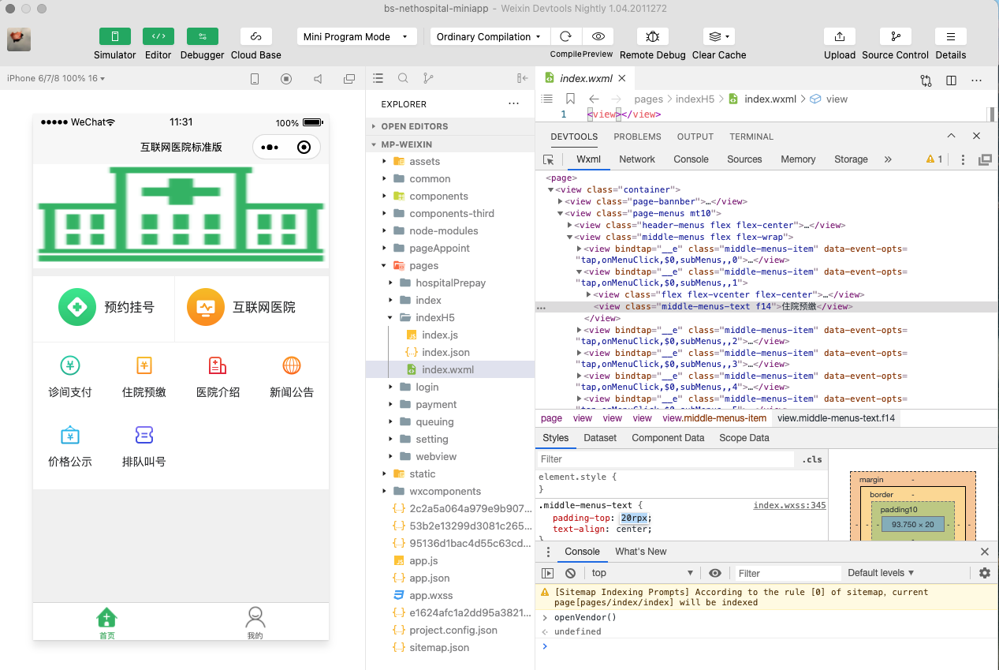
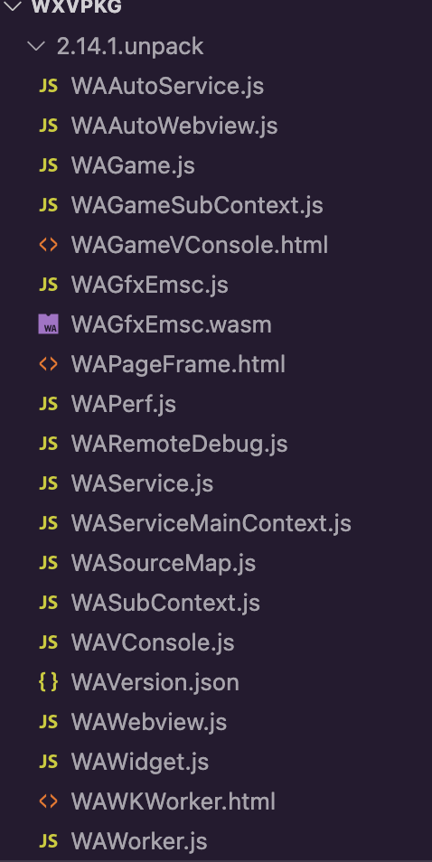

<Boxx  changeTime="5000"/>  

## 前言

互联网生态演进：超级 APP + 小程序成为「轻应用时代」下的新生态。


一方面微信、支付宝等各家小程序平台遍地开花，另一方面移动开发插件化技术逐渐没落，移动应用构建的方式在悄悄的发生变化。对于企业应用形态而言，也在逐步发生变化，超级 APP（移动门户）+ 轻应用是一种新的流行趋势。微信、支付宝是互联网生态下的“移动门户”，手机银行是金融典型的 ToC “移动门户”。

小程序方式构建应用是大趋势，被越来越多的企业用户看到其中的优势，构建一个跨多端平台的小程序开发平台是一种思路，帮助企业用户构建一个具备小程序能力的“移动门户”也是一种思路。本文主要调研微信小程序运行时的基本原理，从而构建一个适合我们自己平台的小程序运行框架。

## 双线程模型

小程序的渲染层和逻辑层分别由两个线程管理：渲染层的界面使用 WebView 进行渲染；逻辑层采用 JSCore 运行 JavaScript 代码。一个小程序存在多个界面，所以渲染层存在多个 WebView。这两个线程间的通信经由小程序 Native 侧中转，逻辑层发送网络请求也经由 Native 侧转发，小程序的通信模型下图所示。


小程序的双层架构思想可以追溯到 PWA，但又有所扬弃。

|        |                              PWA                               |                      小程序框架                      |
|:------:|:--------------------------------------------------------------:|:----------------------------------------------------:|
| 逻辑层 | 以 Service Worker 为载体。开发者需编写业务逻辑、管理资源缓存。 | 以 JSCore 或 V8 引擎为载体。开发者只需编写业务逻辑。 |
| 渲染层 |              基于 Web 网页的单页或多标签页方案。               |           基于多个 WebView 组成的页面栈。            |

小程序框架与 PWA 相比，小程序的开发者可以更聚焦于业务逻辑，而无需关注静态资源的缓存。小程序包的缓存和更新机制交由小程序框架自动完成，开发者可以在适当时机通过 API 影响这一过程。小程序的渲染层由多个 WebView 组成的页面栈构成，这与 PWA 相比有着更接近移动端原生应用的用户体验。同时，小程序的开发者也能更从容地处理多页面间跳转时页面状态的变化。

类似于微信 JSSDK 这样的 Hybrid 技术，微信小程序的界面主要由成熟的 Web 技术渲染，辅之以大量的接口提供丰富的客户端原生能力。同时，每个小程序页面都是用不同的 WebView 去渲染，这样可以提供更好的交互体验，更贴近原生体验，也避免了单个 WebView 的任务过于繁重。此外，界面渲染这一块我们定义了一套内置组件以统一体验，并且提供一些基础和通用的能力，进一步降低开发者的学习门槛。值得一提的是，内置组件有一部分较复杂组件是用客户端原生实现的同层渲染，以提供更好的性能。

**为什么要这么设计呢？**

> 为了管控和安全，微信小程序阻止开发者使用一些浏览器提供的，诸如跳转页面、操作 DOM、动态执行脚本的开放性接口。将逻辑层与视图层进行分离，视图层和逻辑层之间只有数据的通信，可以防止开发者随意操作界面，更好的保证了用户数据安全。

微信小程序视图层是 WebView，逻辑层是 JS 引擎。三端的脚本执行环境以及用于渲染非原生组件的环境是各不相同的：

|     运行环境     |     逻辑层     |      渲染层       |
|:----------------:|:--------------:|:-----------------:|
|     Android      |       V8       | Chromium 定制内核 |
|       iOS        | JavaScriptCore |     WKWebView     |
| 小程序开发者工具 |      NWJS      |  Chrome WebView   |

我们看一下单 WebView 实例与小程序双线程多实例下代码执行的差异点。


单 WebView 模式下，Page 视图与 App 逻辑共享同一个 JSContext，这样所有的页面可以共享全局的数据和方法，能够实现全局的状态管理。多 WebView 模式下，每一个 WebView 都有一个独立的 JSContext，虽然可以通过窗口通信实现数据传递，但是无法共享数据和方法，对于全局的状态管理也相对比较复杂，抽离一个通用的 WebView 或者 JS Engine 作为应用的 JSContext 就可以解决这些问题，但是同时引入了其他问题：视图和逻辑如何通信，在小程序里面数据更新后视图是异步更新的。

双线程交互的生命周期图示：


## 开发工具

微信开发者工具是基于 `NW.js` 构建，主要由工具栏、模拟器、编辑器、调试器四大部分组成。通过 **微信开发者工具** => **调试** => **调试微信微信开发者工具** 可以打开小程序 IDE DevTools 面板。通过 DevTools 审查我们可以发现模拟器是通过 WebView 展示页面。微信小程序是双线程的设计，所以存在视图层和逻辑层两个 WebView。

### 调试逻辑层

在微信开发者工具中，Workbench 的 DevTools 调试器默认与模拟器逻辑层连接，所以 DevTools 中的 Console 面板进行输入 JS 脚本，JS 脚本实际的执行环境是逻辑层的 JS Context，对于逻辑层的调试，可以直接在调试器中进行。编译运行你的小程序项目，然后打开控制台，输入 `document` 并回车，就可以看到小程序逻辑层 WebView，如下图：


### 调试视图层

模拟器视图层 WebView 的就相对逻辑层麻烦一些，需要在 IDE 的 DevTools 下中注入 JS 打开视图层 WebView 的 DevTools。

IDE DevTools 面板的 Console Panel 输入：

```js
// 查找 WebView 元素
$$('webview')
// 打开 视图层 WebView DevTools
$$('webview')[0].showDevTools(true)
```

然后就可以在视图层 WebView 的 DevTools 中进行调试了。



### 逆向技巧

#### 获取基础库

我们如何能够拿到视图层和逻辑层 WebView 加载的文件呢？

- 基于 Sources 面板的 Save AS 功能获取代码


- 基于开发者工具内置命令 `openVendor()` 找到 .wxvpkg 包获取代码

在开发者工具中使用 `help()` 方法，可以查看一些指令和方法。


`openVendor` 命令可以打开微信开发者工具在小程序框架所在目录。我们可以在微信小程序 IDE 控制台输入 openVendor 命令，可以打开微信小程序开发工具的资源目录：


我们可以看到有 `wcc`、`wcsc`，小程序各版本的基础库包 `.wxvpkg`。`.wxvpkg` 文件可以使用 [wechat-app-unpack](https://github.com/leo9960/wechat-app-unpack) 解开，解开后里面就是 `WAService.js` 和 `WAWebView.js` 等代码。

- 利用 [apktool](https://github.com/iBotPeaches/Apktool) 反编译微信客户端

我们可以找到 `wxa_library` 文件夹，这个和上面微信开发工具中 `.wxvpkg` 包解开的结构很类似，这就是小程序的基础库。

#### 反编译代码

- 利用 [unwxvpkgPlugin](https://github.com/liugangtaotie/unwxvpkgPlugin) 模块解包

## Usage


解开后的目录结构：



客户端中的 .wxvpkg 包比 IDE WeappVendor 文件夹下的包多一些文件。

- 利用 [js-beautify](https://www.npmjs.com/package/js-beautify) 美化代码

```js
find . -type f -name '*.js' -exec js-beautify -r -s 2 -p -f '{}' \;
```

- 利用 [jsnice](http://jsnice.org/) 美化代码


关于代码的逆向还原细节本文暂不做详细介绍，后面专门写文章展开讲解。

## 基础库

### 整体架构

小程序的基础库是 JavaScript 编写的，基础库提供组件和 API，处理数据绑定、组件系统、事件系统、通信系统等一系列框架逻辑，可以被注入到渲染层和逻辑层运行。在渲染层可以用各类组件组建界面的元素，在逻辑层可以用各类 API 来处理各种逻辑。PageView 可以是 WebView、React-Native-Like、Flutter 来渲染，详细架构设计可以参考：[基于小程序技术栈的微信客户端跨平台实践](https://ppt.geekbang.org/slide/show?cid=42&pid=2338)。


小程序的基础库主要分为：

- WAWebview：小程序视图层基础库，提供视图层基础能力
- WAService：小程序逻辑层基础库，提供逻辑层基础能力

微信小程序基础库更新过程可能会对基础库有些变更，下面就 v2.10.4 版本对基础库进行分析：

### WAWebview 源码结构

借助于 VS Code 折叠功能，将基础库中 WAWebview 文件美化后，并且进行必要的模块结构拆分，可以看到代码主要结构如下：

```js
var __wxLibrary = {
  fileName: 'WAWebview.js',
  envType: 'WebView',
  contextType: 'others',
  execStart: Date.now()
};
var __WAWebviewStartTime__ = Date.now();
var __libVersionInfo__ = {
  "updateTime": "2020.4.4 10:25:02",
  "version": "2.10.4"
};

/**
 * core-js 模块
 */
!function(n, o, Ye) {
  ...
  }, function(e, t, i) {
    var n = i(3),
      o = "__core-js_shared__",
      r = n[o] || (n[o] = {});
    e.exports = function(e) {
      return r[e] || (r[e] = {})
    }
  ...
}(1, 1);

var __wxConfig;
var __wxTest__ = false;

var wxRunOnDebug = function(e) {
  e()
};

/**
 * 基础模块
 */
var Foundation = function(i) {
  ...
}]).default;

var nativeTrans = function(e) {
  ...
}(this);

/**
 * 消息通信模块
 */
var WeixinJSBridge = function(e) {
  ...
}(this);

/**
 * 监听 nativeTrans 相关事件
 */
!function() {
  ...
}();

/**
 * 解析配置
 */
!function(r) {
  ...
  __wxConfig = _(__wxConfig), __wxConfig = v(__wxConfig), Foundation.onConfigReady(function() {
    m()
  }), n ? __wxConfig.__readyHandler = A : d ? Foundation.onBridgeReady(function() {
    WeixinJSBridge.on("onWxConfigReady", A)
  }) : Foundation.onLibraryReady(A)
}(this);

/**
 * 异常捕获（error、onunhandledrejection）
 */
!function(e) {
  function t(e) {
    Foundation.emit("unhandledRejection", e) || console.error("Uncaught (in promise)", e.reason)
  }
  "object" == typeof e && "function" == typeof e.addEventListener ? (e.addEventListener("unhandledrejection", function(e) {
    t({
      reason: e.reason,
      promise: e.promise
    }), e.preventDefault()
  }), e.addEventListener("error", function(e) {
    var t;
    t = e.error, Foundation.emit("error", t) || console.error("Uncaught", t), e.preventDefault()
  })) : void 0 === e.onunhandledrejection && Object.defineProperty(e, "onunhandledrejection", {
    value: function(e) {
      t({
        reason: (e = e || {}).reason,
        promise: e.promise
      })
    }
  })
}(this);

/**
 * 原生缓冲区
 */
var NativeBuffer = function(e) {
  ...
}(this);
var WeixinNativeBuffer = NativeBuffer;
var NativeBuffer = null;

/**
 * 日志模块：wxConsole、wxPerfConsole、wxNativeConsole、__webviewConsole__
 */
var wxConsole = ["log", "info", "warn", "error", "debug", "time", "timeEnd", "group", "groupEnd"].reduce(function(e, t) {
  return e[t] = function() {}, e
}, {});

var wxPerfConsole = ["log", "info", "warn", "error", "time", "timeEnd", "trace", "profile", "profileSync"].reduce(function(e, t) {
  return e[t] = function() {}, e
}, {});

var wxNativeConsole = function(i) {
  ...
}([function(e, t, i) {
  ...
}]).default;

var __webviewConsole__ = function(i) {
  ...
}([function(e, t, i) {
  ...
}]);

/**
 * 上报模块
 */
var Reporter = function(i) {
  ...
}([function(e, L, O) {
  ...
}]).default;

var Perf = function(i) {
  ...
}([function(e, t, i) {
  ...
}]).default;

/**
 * 视图层 API
 */
var __webViewSDK__ = function(i) {
  ...
}([function(e, L, O) {
  ...
}]).default;
var wx = __webViewSDK__.wx;

/**
 * 组件系统
 */
var exparser = function(i) {
  ...
}([function(e, t, i) {
  ...
}]);

/**
 * 框架粘合层
 * 
 * 使用 exparser.registerBehavior 和 exparser.registerElement 方法注册内置组件
 * 转发 window、wx 对象上到事件转发到 exparser
 */
!function(i) {
  ...
}([function(e, t) {
  ...
}, function(e, t) {}, , function(e, t) {}]);

/**
 * Virtual DOM 
 */
var __virtualDOMDataThread__ = false;
var __virtualDOM__ = function(i) {
  ...
}([function(e, t, i) {
  ...
}]);

/**
 * __webviewEngine__
 */
var __webviewEngine__ = function(i) {
  ...
}([function(e, t, i) {
  ...
}]);

/**
 * 注入默认样式到页面
 */
!function() {
  ...
  function e() {
     var e = i('...');
    __wxConfig.isReady ? void 0 !== __wxConfig.theme && i(t, e.nextElementSibling) : __wxConfig.onReady(function() {
      void 0 !== __wxConfig.theme && i(t, e.nextElementSibling)
    })
  }
  window.document && "complete" === window.document.readyState ? e() : window.onload = e
}();

var __WAWebviewEndTime__ = Date.now();
typeof __wxLibrary.onEnd === 'function' && __wxLibrary.onEnd();
__wxLibrary = undefined;
```

WAWebview 主要由以下几个部分组件：

- `Foundation`: 基础模块
- `WeixinJSBridge`: 消息通信模块
- `exparser`: 组件系统模块
- `__virtualDOM__`: Virtual DOM 模块
- `__webViewSDK__`: WebView SDK 模块
- `Reporter`: 日志上报模块(异常和性能统计数据)

### WAService 源码结构

WAService 的整体结构如下：

```js
var __wxLibrary = {
  fileName: 'WAService.js',
  envType: 'Service',
  contextType: 'App:Uncertain',
  execStart: Date.now()
};
var __WAServiceStartTime__ = Date.now();

(function(global) {
  var __exportGlobal__ = {};
  var __libVersionInfo__ = {
    "updateTime": "2020.4.4 10:25:02",
    "version": "2.10.4"
  };
  var __Function__ = global.Function;
  var Function = __Function__;

  /**
   * core-js 模块
   */
  !function(r, o, Ke) {
  }(1, 1);

  var __wxTest__ = false;
  var wxRunOnDebug = function(e) {
    e()
  };

  var __wxConfig;
  /**
   * 基础模块
   */
  var Foundation = function(n) {
    ...
  }([function(e, t, n) {
    ...
  }]).default;

  var nativeTrans = function(e) {
    ...
  }(this);

  /**
   * 消息通信模块
   */
  var WeixinJSBridge = function(e) {
    ...
  }(this);

  /**
   * 监听 nativeTrans 相关事件
   */
  !function() {
    ...
  }();

  /**
   * 解析配置
   */
  !function(i) {
    ...
  }(this);

  /**
   * 异常捕获（error、onunhandledrejection）
   */
  !function(e) {
    ...
  }(this);

  /**
   * 原生缓冲区
   */
  var NativeBuffer = function(e) {
    ...
  }(this);
  WeixinNativeBuffer = NativeBuffer;
  NativeBuffer = null;

  var wxConsole = ["log", "info", "warn", "error", "debug", "time", "timeEnd", "group", "groupEnd"].reduce(function(e, t) {
      return e[t] = function() {}, e
    }, {});

  var wxPerfConsole = ["log", "info", "warn", "error", "time", "timeEnd", "trace", "profile", "profileSync"].reduce(function(e, t) {
    return e[t] = function() {}, e
  }, {});

  var wxNativeConsole = function(n) {
    ...
  }([function(e, t, n) {
    ...
  }]).default;

  /**
   * Worker 模块
   */
  var WeixinWorker = function(e) {
    ...
  }(this);

  /**
   * JSContext
   */
  var JSContext = function(n) {
    ...
  }([
    ...
  }]).default;

  var __appServiceConsole__ = function(n) {
    ...
  }([function(e, N, R) {
    ...
  }]).default;

  var Protect = function(n) {
    ...
  }([function(e, t, n) {
    ...
  }]);

  var Reporter = function(n) {
    ...
  }([function(e, N, R) {
    ...
  }]).default;

  var __subContextEngine__ = function(n) {
    ...
  }([function(e, t, n) {
    ...
  }]);

  var __waServiceInit__ = function() {
    ...
  }

  function __doWAServiceInit__() {
    var e;
    "undefined" != typeof wx && wx.version && (e = wx.version), __waServiceInit__(), e && "undefined" != typeof __exportGlobal__ && __exportGlobal__.wx && (__exportGlobal__.wx.version = e)
  }
  __subContextEngine__.isIsolateContext();
  __subContextEngine__.isIsolateContext() || __doWAServiceInit__();
  __subContextEngine__.initAppRelatedContexts(__exportGlobal__);
})(this);

var __WAServiceEndTime__ = Date.now();
typeof __wxLibrary.onEnd === 'function' && __wxLibrary.onEnd();
__wxLibrary = undefined;
```

WAService 基本组成：

- `Foundation`: 基础模块
- `WeixinJSBridge`: 消息通信模块
- `WeixinNativeBuffer`: 原生 `Buffer`
- `WeixinWorker`: `Worker` 线程
- `JSContext`: JS Engine Context
- `Protect`: JS 保护的对象
- `__subContextEngine__`: 提供 `App`、`Page`、`Component`、`Behavior`、`getApp`、`getCurrentPages` 等方法

### Foundation 模块

基础模块提供环境变量 env、发布订阅 EventEmitter、配置/基础库/通信桥 Ready 事件。


### Exparser 模块

小程序的视图是在 WebView 里渲染的，为解决管控与安全，小程序里面不能使用 Web 组件和动态执行 JavaScript。Exparser 是微信小程序的组件组织框架，内置在小程序基础库中，为小程序的各种组件提供基础的支持。小程序内的所有组件，包括内置组件和自定义组件，都由 Exparser 组织管理。Exparser 的组件模型与 WebComponents 标准中的 ShadowDOM 高度相似。Exparser 会维护整个页面的节点树相关信息，包括节点的属性、事件绑定等，相当于一个简化版的 Shadow DOM 实现。

Exparser 的主要特点包括以下几点：

- 基于 Shadow DOM 模型：模型上与 WebComponents 的 ShadowDOM 高度相似，但不依赖浏览器的原生支持，也没有其他依赖库；实现时，还针对性地增加了其他 API 以支持小程序组件编程。
- 可在纯 JS 环境中运行：这意味着逻辑层也具有一定的组件树组织能力。
- 高效轻量：性能表现好，在组件实例极多的环境下表现尤其优异，同时代码尺寸也较小。

小程序中，所有节点树相关的操作都依赖于 Exparser，包括 WXML 到页面最终节点树的构建、createSelectorQuery 调用和自定义组件特性等。

### Virtual DOM 模块

Virtual DOM 模块提供了如下几个方法：


接口与 [virtual-dom](https://github.com/Matt-Esch/virtual-dom) 类似，这里特别的地方在于它所 diff 和生成的并不是原生 DOM，而是各种模拟了 DOM 接口的 wx- element 对象。

### WeixinJSBridge 模块

WeixinJSBridge 提供了视图层 JS 与 Native、视图层与逻辑层之间消息通信的机制，提供了如下几个方法:

|         方法名          |              作用               |
|:-----------------------:|:-------------------------------:|
|         invoke          |       JS 调用 Native API        |
|  invokeCallbackHandler  | Native 传递 invoke 方法回调结果 |
|           on            |       JS 监听 Native 消息       |
|         publish         |         视图层发布消息          |
|        subscribe        |        订阅逻辑层的消息         |
|    subscribeHandler     |   视图层和逻辑层消息订阅转发    |
| setCustomPublishHandler |         自定义消息转发          |

## 编译原理

微信开发者工具和微信客户端都无法直接运行小程序的源码，因此我们需要对小程序的源码进行编译。代码编译过程包括本地预处理、本地编译和服务器编译。为了快速预览，微信开发者工具模拟器运行的代码只经过本地预处理、本地编译，没有服务器编译过程，而微信客户端运行的代码是额外经过服务器编译的。

微信官方提供了 `wcc` 和 `wcsc` 两个编译工具，`wcc` 编译器可以将 `wxml` 文件编译成 `JS` 文件，`wcsc` 编译器可以将 `wxss` 文件编译成 `JS` 文件。

### 编译 WXML

我们这里一步步去研究微信官方编译器，先研究看看 wcc 做了什么事情。

例如编译 wxml 为 JS：

index.wxml:

```html
<view>
  <text class="window">{{ text }}</text>
</view>
```

借助 [miniprogram-compiler](https://www.npmjs.com/package/miniprogram-compiler) 转化：

```js
const fs = require("fs");
const miniprogramCompiler = require("miniprogram-compiler");

const path = require("path");
let compileResult = miniprogramCompiler.wxmlToJs(path.join(__dirname));
fs.writeFileSync("index.wxml.js", compileResult);
```

编译之后的代码为：

```js
window.__wcc_version__ = 'v0.5vv_20181221_syb_scopedata';
window.__wcc_version_info__ = {
  customComponents: true,
  fixZeroRpx: true,
  propValueDeepCopy: false
};
var $gwxc;
var $gaic = {};
$gwx = function(path, global) {
  ...
}
return $gwx;
```

我们深入 `miniprogramCompiler.wxmlToJs` 源码最终会发现调用的是 `wcc`，这个正是微信开发工具下的编译工具。

通过上述编译生存的代码我们发现，调用 `$gwx` 函数会再生成一个有返回值的函数，于是我们执行如下代码：

```js
$gwx("index.wxml")();
```

得出如下内容：

```json
{
  "tag": "wx-page",
  "children": [
    {
      "tag": "wx-view",
      "attr": {},
      "children": [
        {
          "tag": "wx-text",
          "attr": { "class": "window" },
          "children": [""],
          "raw": {},
          "generics": {}
        }
      ],
      "raw": {},
      "generics": {}
    }
  ]
}
```

这是一个类似 Virtual DOM 的对象，交给了 WAWebivew 来渲染，标签名为 wx-view、wx-text。

上面的 wx-text 是没有绑定数据的，那么上面的 Virtual DOM 是怎么变成真实的 DOM 呢？$gwx 是一个闭包函数，$gwx 函数第一个参数是 path，页面 wxml 文件的路径；global 参数应该是顶层对象。

```js
$gwx = function (path, global) {
  ...
  if (path && e_[path]) {
    window.__wxml_comp_version__ = 0.02;
    return function (env, dd, global) {
      $gwxc = 0;
      var root = { tag: "wx-page" };
      root.children = [];
      var main = e_[path].f;
      cs = [];
      if (typeof global === "undefined") global = {};
      global.f = $gdc(f_[path], "", 1);
      if (
        typeof window.__webview_engine_version__ != "undefined" &&
        window.__webview_engine_version__ + 1e-6 >= 0.02 + 1e-6 &&
        window.__mergeData__
      ) {
        // 合并 Data 数据
        env = window.__mergeData__(env, dd);
      }
      try {
        main(env, {}, root, global);
        _tsd(root);
        if (
          typeof window.__webview_engine_version__ == "undefined" ||
          window.__webview_engine_version__ + 1e-6 < 0.01 + 1e-6
        ) {
          return _ev(root);
        }
      } catch (err) {
        console.log(cs, env);
        console.log(err);
        throw err;
      }
      return root;
    }
  }
}
```

`window.__webview_engine_version__` 大于等于 0.02 版本的使用 `window.__mergeData__` 进行数据 merge，这里可以推测 dd 参数是新数据，env 是当前数据。这里的 `window.__mergeData__` 是在 WAWebview 中定义的：

```js
var E = window.__virtualDOM__;
...
window.__mergeData__ = E.getMergeDataFunc();
```

这里的 `window.__virtualDOM__` 是基础库中 Virtual DOM 的实现。

如果我们直接执行下面的代码：

```js
// $gwx 是 WXML 编译后得到的函数，根据页面路径获取页面结构生成函数
const generateFunction = $gwx("pages/index/index.wxml");
const virtualTree = generateFunction({
  text: 'Hello World'
});
console.log(virtualTree);
```

可以得到如下的 Virtual DOM 结构：

```js
{
  "tag": "wx-page",
  "children": [
    {
      "tag": "wx-view",
      "attr": {},
      "children": [{
        "tag": "wx-text",
        "attr": {
          "class": "name"
        },
        "children": ["Hello World"],
        "raw": {},
        "generics": {}
      }],
      "raw": {},
      "generics": {}
    }
  ]
}
```

setData 的机制如下：


## 通信原理

小程序逻辑层和渲染层的通信会由 Native （微信客户端）做中转，逻辑层发送网络请求也经由 Native 转发。

**视图层组件**:

内置组件中有部分组件是利用到客户端原生提供的能力，既然需要客户端原生提供的能力，那就会涉及到视图层与客户端的交互通信。这层通信机制在 iOS 和安卓系统的实现方式并不一样，iOS 是利用了 WKWebView 的提供 messageHandlers 特性，而在安卓则是往 WebView 的 window 对象注入一个原生方法，最终会封装成 WeiXinJSBridge 这样一个兼容层，主要提供了调用（invoke）和监听（on）这两种方法。

我们知道微信小程序逻辑层没有浏览器的 DOM/BOM，视图层的更新借助于 Virtual DOM。用 JS 对象模拟 DOM 树 -> 比较两棵虚拟 DOM 树的差异 -> 把差异应用到真正的 DOM 树上，状态更新的时候，通过对比前后 JS 对象变化，进而改变视图层的 Dom 树。实际上，在视图层与客户端的交互通信中，开发者只是间接调用的，真正调用是在组件的内部实现中。开发者插入一个原生组件，一般而言，组件运行的时候被插入到 DOM 树中，会调用客户端接口，通知客户端在哪个位置渲染一块原生界面。在后续开发者更新组件属性时，同样地，也会调用客户端提供的更新接口来更新原生界面的某些部分。

**逻辑层接口**:

逻辑层与客户端原生通信机制与渲染层类似，不同在于，iOS 平台可以往 JavaScripCore 框架注入一个全局的原生方法，而安卓方面则是跟渲染层一致的。

同样地，开发者也是间接地调用到与客户端原生通信的底层接口。一般我们会对逻辑层接口做层封装后才暴露给开发者，封装的细节可能是统一入参、做些参数校验、兼容各平台或版本问题等等。

## 启动流程

通过分析 `WAPageFrame.html` 文件，我们可以得到小程序的启动执行流程大致如下：


**第一步：初始化全局变量**

```js
var __wxRoute,
  __wxRouteBegin,
  __wxAppCurrentFile__,
  __wxAppData = {},
  __wxAppCode__ = {},
  __vd_version_info__ = {},
  Component = function() {},
  Behavior = function() {},
  definePlugin = function() {},
  requirePlugin = function() {};
global = {};
var $gwx,
  __workerVendorCode__ = {},
  __workersCode__ = {},
  __WeixinWorker = (WeixinWorker = {});

var __wxConfig = {
  // ...
};

var __devtoolsConfig = {
  // ...
};
```

- `__wxRoute`: 用于指向当前正在加载的页面路径
- `__wxRouteBegin`: 用于标志 Page 的正确注册
- `__wxAppCurrentFile__`: 用于指向当前正在加载的 JS 文件
- `__wxAppData`: 小程序每个页面的 data 域对象，如下：
- `__wxAppCode__`: 在开发者工具中分为两类值，`json` 类型和 `wxml` 类型。以 `.json` 结尾的，其 `key` 值为开发者代码中对应的 `json` 文件的内容，`.wxml` 结尾的，其 key 值为通过调用 `$gwx('./pages/index/index.wxml')` 将得到一个可执行函数，通过调用这个函数可得到一个标识节点关系的 JSON 树。
- `Component`: 自定义组件构造器
- `Behavior`: 自定义组件 behavior 构造器
- `definePlugin`: 自定义插件的构造器
- `global`: 全局对象
- `__WeixinWorker`: 多线程构造器
- `__wxConfig`: 对象是根据全局配置和页面配置生成的配置对象，如下：

```json
{
  "pages": ["pages/index/index", "pages/logs/logs"],
  "resizable": false,
  "debug": false,
  "widgets": [],
  "customClose": false,
  "workers": "",
  "navigateToMiniProgramAppIdList": [],
  "cloud": false,
  "global": {
    "window": {
      "backgroundTextStyle": "light",
      "navigationBarBackgroundColor": "#fff",
      "navigationBarTitleText": "WeChat",
      "navigationBarTextStyle": "black"
    }
  },
  "page": {
    "pages/index/index.html": { "window": { "usingComponents": {} } },
    "pages/logs/logs.html": {
      "window": {
        "navigationBarTitleText": "查看启动日志",
        "usingComponents": {}
      }
    }
  },
  "networkTimeout": {
    "request": 60000,
    "uploadFile": 60000,
    "connectSocket": 60000,
    "downloadFile": 60000
  },
  "ext": {},
  "extAppid": "",
  "mainPlugins": {},
  "__warning__": "",
  "entryPagePath": "pages/index/index.html",
  "tabBar": { "list": [] },
  "appType": 0,
  "urlCheck": true,
  "wxAppInfo": {
    "maxRequestConcurrent": 10,
    "maxUploadConcurrent": 10,
    "maxDownloadConcurrent": 10,
    "maxWorkerConcurrent": 1
  },
  "accountInfo": {
    "appId": "",
    "nickname": "赞同技术",
    "icon": ""
  },
  "platform": "devtools",
  "appLaunchInfo": { "scene": 1001, "path": "pages/index/index", "query": {} },
  "env": {
    "USER_DATA_PATH": "http://usr"
  },
  "envVersion": "develop"
}
```

**第二步：加载框架（WAService.js）**

我们调用的 API 等核心主要是 `__waServiceInit__` 部分，主要结构如下：

```js
__waServiceInit__ = function() {
  var bta = function(n) {
      // ...
    }({
      // ...
    }),
    cta = function(n) {
    }([
      // ...
    ]).default,
    dta = cta.wx;

  "undefined" != typeof __exportGlobal__ && (__exportGlobal__.wx = dta);

  var eta = function(n) {
      // ...
    }([
      // ...
    }]),
    gta = function(n) {
      // ...
    }([
      // ...
    ]),
    hta = function(n) {
    }([function(e, t, n) {}]);

  hta.Page, hta.Component, hta.Behavior, hta.App, hta.getApp, hta.getCurrentPages;
  "undefined" != typeof __exportGlobal__ && (
    __exportGlobal__.Page = hta.Page,
    __exportGlobal__.Component = hta.Component,
    __exportGlobal__.Behavior = hta.Behavior,
    __exportGlobal__.__webview_engine_version__ = .02,
    __exportGlobal__.App = hta.App,
    __exportGlobal__.getApp = hta.getApp,
    __exportGlobal__.getCurrentPages = hta.getCurrentPages,
    __exportGlobal__.__pageComponent = null);

  var qta = function(n) {
      // ...
    }([
      // ...
    ]),
    qta.definePlugin, qta.requirePlugin;

  // 定义 define require 方法
  !function(e) {
  }();

  var tta = require;
  if (__exportGlobal__.definePlugin = qta.definePlugin,
    __exportGlobal__.requirePlugin = qta.requirePlugin,
    "function" == typeof __passWAServiceGlobal__) {
    var uta = {};
    uta.__appServiceEngine__ = hta,
    uta.__appServiceSDK__ = cta,
    uta.__virtualDOM__ = gta,
    uta.__subContextEngine__ = __subContextEngine__,
    uta.Reporter = Reporter,
    uta.exparser = eta,
    uta.WeixinJSBridge = WeixinJSBridge,
    uta.Protect = Protect,
    __passWAServiceGlobal__(uta)
	}
};
```

`__waServiceInit__` 中定义了框架核心对象，如：`__appServiceEngine__`、`__virtualDOM__`、`exparser`。其中`__appServiceEngine__` 提供了框架最基本的对外接口，如 `App`、`Page`、`Component`、`Behavior`、`getApp`、`getCurrentPages` 等方法；`exparser` 提供了框架底层的能力，如实例化组件，数据变化监听，View 层与逻辑层的交互等；`__virtualDOM__` 则起着连接 `__appServiceEngine__` 和 `exparser` 的作用，如对开发者传入 `Page` 方法的对象进行格式化再传入 `exparser` 的对应方法处理。

**第三步：业务代码的加载**

在小程序中，开发者的 JavaScript 代码会被打包为 AMD 规范的 JS 模块：

```js
define("pages/index/index.js", function(
  require,
  module,
  exports,
  window,
  document,
  frames,
  self,
  location,
  navigator,
  localStorage,
  history,
  Caches,
  screen,
  alert,
  confirm,
  prompt,
  fetch,
  XMLHttpRequest,
  WebSocket,
  webkit,
  WeixinJSCore,
  Reporter,
  print,
  URL,
  DOMParser,
  upload,
  preview,
  build,
  showDecryptedInfo,
  cleanAppCache,
  syncMessage,
  checkProxy,
  showSystemInfo,
  openVendor,
  openToolsLog,
  showRequestInfo,
  help,
  showDebugInfoTable,
  closeDebug,
  showDebugInfo,
  __global,
  loadBabelMod,
  WeixinJSBridge
) {
  "use strict";

  // index.js 代码

});
```

`AMD` 规范接口，通过 `define` 定义一个模块，使用 `require` 来应用一个模块。上面说了 `WAService` 里定义了两个方法：`require` 和 `define` 用来定义和使用业务代码。首先 `define` 限制了模块可使用的其他模块，如 `window`，`document`；其次 `require` 在使用模块时只会传入 `require` 和 `module`，也就是说参数中的其他模块在定义的模块中都是 `undefined`，这也是不能在小程序中获取一些浏览器环境对象的原因。

在小程序中，`JavaScript` 代码的加载方式和在浏览器中也有些不同，其加载顺序是首先加载项目中其他 js 文件（非注册程序和注册页面的 js 文件），其次是注册程序的 `app.js`，然后是自定义组件 js 文件，最后才是注册页面的 js 代码。而且小程序对于在 `app.js` 以及注册页面的 js 代码都会加载完成后立即使用 `require` 方法执行模块中的程序。其他的代码则需要在程序中使用 `require` 方法才会被执行。

**第四步：加载 app.js 与注册程序**

在 app.js 加载完成后，小程序会使用 `require('app.js')` 注册程序，即对 App 方法进行调用。App 方法是对 `__appServiceEngine__.App` 方法的引用。

```js
// 注册 app.js，初始化 App
require("app.js");

var decodePathName = decodeURI("pages/index/index");
__wxAppCode__[decodePathName + ".json"] = { usingComponents: {} };
__wxAppCode__[decodePathName + ".wxml"] = $gwx("./" + decodePathName + ".wxml");

var decodePathName = decodeURI("pages/logs/logs");
__wxAppCode__[decodePathName + ".json"] = {
  navigationBarTitleText: "查看启动日志",
  usingComponents: {}
};
__wxAppCode__[decodePathName + ".wxml"] = $gwx("./" + decodePathName + ".wxml");

var decodePathName = decodeURI("pages/index/index");
__wxRoute = decodePathName;
__wxRouteBegin = true;
__wxAppCurrentFile__ = decodePathName + ".js";
require(decodePathName + ".js");

var decodePathName = decodeURI("pages/logs/logs");
__wxRoute = decodePathName;
__wxRouteBegin = true;
__wxAppCurrentFile__ = decodePathName + ".js";
require(decodePathName + ".js");
```

下图是框架对于 App 方法调用时的处理流程：


`App()` 函数用来注册一个小程序，接收一个 object 对象参数，其指定小程序的生命周期函数等，`getApp()` 函数可以用来获取到小程序实例。`App()` 和 `getApp()` 的函数声明如下：

```ts
declare const App: App.AppConstructor;
declare const getApp: App.GetApp;
```

完整的参考：[lib.wx.app.d.ts](https://github.com/wechat-miniprogram/api-typings/blob/master/types/wx/lib.wx.app.d.ts)

微信小程序 `App` 和 `getApp` 的源码混淆了，内部实现不方便我们去追踪，这里我们先不深究，后面参考 wepet、hera 等框架我们再看一下微信小程序早期版本实现。

**第五步：加载自定义组件代码以及注册自定义组件**

自定义组件在 app.js 之后被加载，小程序会在这个过程中加载完所有的自定义组件，并且是加载完成后自动注册，只有注册完成后才会加载下一个自定义组件的代码。

下图是框架对于 Component 方法处理流程：


`Component()` 的函数声明如下：

```ts
declare function Component(options: BaseComponent): void;
```

完整的参考：[lib.wx.component.d.ts](https://github.com/wechat-miniprogram/api-typings/blob/master/types/wx/lib.wx.component.d.ts)

**第六步：加载页面代码和注册页面**

加载页面代码的处理流程和加载自定义组件一样，都是加载完成后先注册页面，然后才会加载下一个页面。

下图是注册一个页面时框架对于 Page 方法的处理流程：


`Page()` 和 `getCurrentPages()` 的函数声明如下：

```ts
declare const Page: Page.PageConstructor;
declare const getCurrentPages: Page.GetCurrentPages;
```

完整的参考：[lib.wx.page.d.ts](https://github.com/wechat-miniprogram/api-typings/blob/master/types/wx/lib.wx.page.d.ts)

**第七步：等待页面 Ready 和 Page 实例化**

严格来讲是等待浏览器 `Ready`，小程序虽然有部分原生的组件，不过本质上还是一个 web 程序。在小程序中切换页面或打开页面时会触发 `onAppRoute` 事件，小程序框架通过 `wx.onAppRoute` 注册页面切换的处理程序，在所有程序就绪后，以 `entryPagePath` 作为入口使用 `appLaunch` 的方式进入页面。

## 参考

- [微信小程序开发指南](https://developers.weixin.qq.com/ebook?action=get_post_info&docid=0008aeea9a8978ab0086a685851c0a)
- [小程序视图层源码分析](https://zaiyewujiang.cn/2019/08/23/mp-view/)
- [小程序逻辑层源码分析](https://zaiyewujiang.cn/2019/08/27/mp-logic/)
- [从源码看微信小程序启动过程](https://juejin.im/post/5afaaef4f265da0b8336e6c3)
- [浅析微信小程序 App() 和 Page() 函数的内部实现](https://kangzubin.com/wxapp-App-Page-function)
- [让别人的小程序运行在自己的 app 中](https://www.jianshu.com/p/51ac882ea9f4)
- [微信小程序性能优化之一](https://www.cnblogs.com/wintersun/p/8207083.html)

