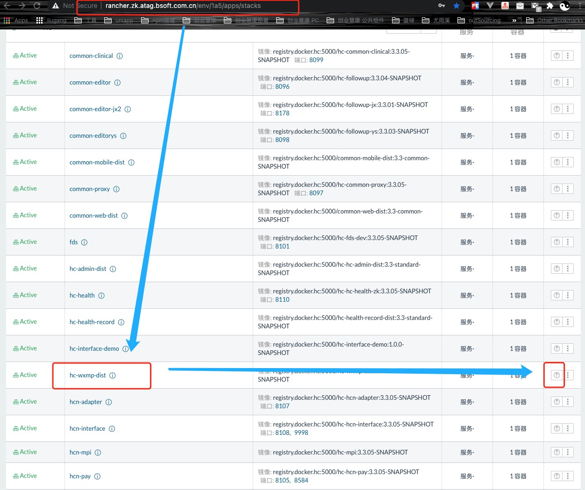
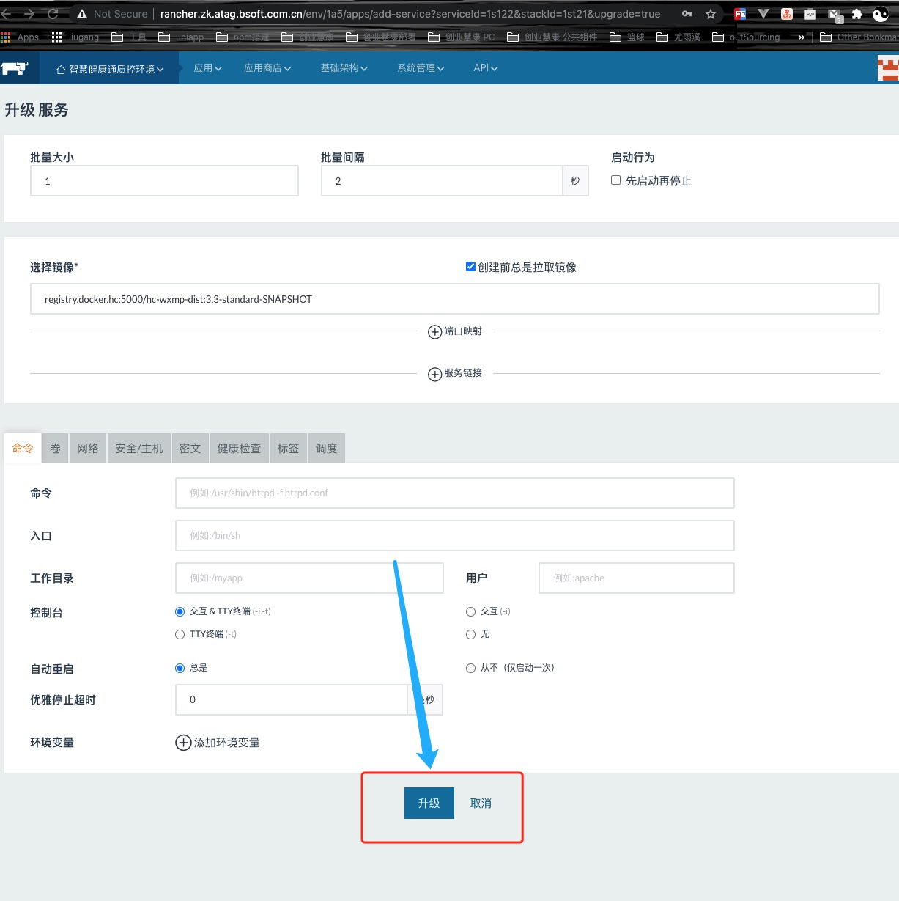
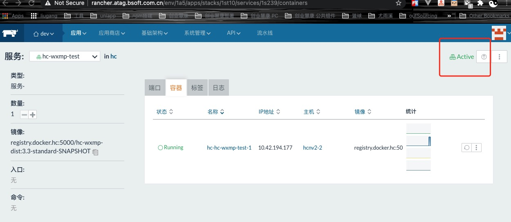
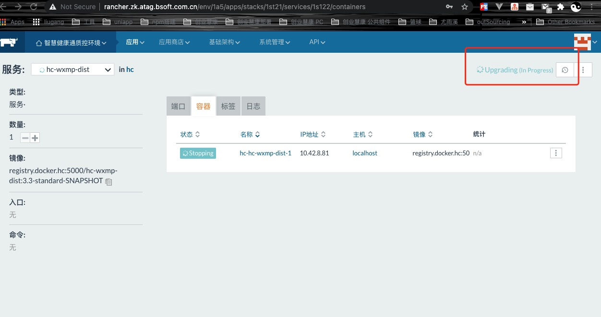
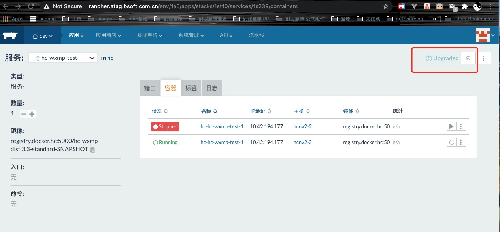

<Boxx  changeTime="5000"/>  

## 一. 背景

* 对应项目部署人员，需要每天进行日常打包（上班日每天下午5点开始打包，发布、部署）大约需要30分钟左右
* 这样浪费了大量时间去进行日常维护，若进行服务器自动打包部署，大约只需要5分钟左右时间，节约25分钟左右

## 二. 价值

* 以前智慧健康通+互联网医院，需要2个人员维护，大约加起来需要60分钟
* 现在进行自动化部署，大约总共需要10分钟左右时间（节约50分钟）
* 这样只需要一个小伙伴即可维护好
* 从长远来看，非常有价值

## 三. 实践

* 半自动化部署：即为以前发布流程（部署人员 -> 本地生成dist-> git push -> jenkins生成docker镜像 -> rancher部署）
* 自动化部署：现在发布流程（部署人员->rancher部署）

### 3.1 example(半自动化部署)

* 部署人员 -> 本地生成dist: 对应项目,执行npm run build / make pro / make build, 把 dist 文件替换对应项目（dist）中的dist;

* git push: git push;

* jenkins生成docker镜像 -> rancher部署 : 

#### 智慧健康通(半自动化部署) 对应表

|    项目环境     |            jenkins 地址            |        项目        |            rancher   地址             |      部署项目      |
|:---------------:|:----------------------------------:|:------------------:|:-------------------------------------:|:------------------:|
| 微信公众号(dev) | http://jenkins.atag.common.com.cn/ | hc-wxmp-v3.3-dist  |  http://rancher.atag.common.com.cn/   |    hc-wxmp-dist    |
| 微信公众号(zk)  |                同上                |        同上        | http://rancher.zk.atag.common.com.cn/ |        同上        |
|  管理平台(dev)  |                同上                | hc-admin-v3.3-dist |  http://rancher.atag.common.com.cn/   |   hc-admin-dist    |
|  管理平台(zk)   |                同上                |        同上        | http://rancher.zk.atag.common.com.cn/ |        同上        |
| 公共mobile(dev) |                同上                | common-mobile-dist |  http://rancher.atag.common.com.cn/   | common-mobile-dist |
| 公共mobile(zk)  |                同上                |        同上        | http://rancher.zk.atag.common.com.cn/ |        同上        |
|  公共web(dev)   |                同上                |  common-web-dist   |  http://rancher.atag.common.com.cn/   |  common-web-dist   |
|   公共web(zk)   |                同上                |        同上        | http://rancher.zk.atag.common.com.cn/ |        同上        |

#### 互联网医院(半自动化部署) 对应表

|     项目环境     |                jenkins 地址                |                  项目                   |               rancher   地址               |                部署项目                 |
|:----------------:|:------------------------------------------:|:---------------------------------------:|:------------------------------------------:|:---------------------------------------:|
| 微信公众号(dev)  | http://jenkins.dev.hol.atag.common.com.cn/ |    bs-nethospital-wechat-alipay-dist    | http://rancher.dev.hol.atag.common.com.cn/ |    bs-nethospital-wechat-alipay-dist    |
|  微信公众号(zk)  |                    同上                    |                  同上                   | http://rancher.zk.hol.atag.common.com.cn/  |                  同上                   |
| 公共patient(dev) |                    同上                    |    bs-nethospital-base-service-dist     | http://rancher.dev.hol.atag.common.com.cn/ |    bs-nethospital-base-service-dist     |
| 公共patient(zk)  |                    同上                    |                  同上                   | http://rancher.zk.hol.atag.common.com.cn/  |                  同上                   |
| 公共doctor(dev)  |                    同上                    | bs-nethospital-base-service-doctor-dist | http://rancher.dev.hol.atag.common.com.cn/ | bs-nethospital-base-service-doctor-dist |
|  公共doctor(zk)  |                    同上                    |                  同上                   | http://rancher.zk.hol.atag.common.com.cn/  |                  同上                   |
|  管理平台(dev)   |                    同上                    |         bs-nethospital-web-dist         | http://rancher.dev.hol.atag.common.com.cn/ |         bs-nethospital-web-dist         |
|   管理平台(zk)   |                    同上                    |                  同上                   | http://rancher.zk.hol.atag.common.com.cn/  |                  同上                   |
| 公共mobile(dev)  |                    同上                    |            common-mobile-hlw            | http://rancher.dev.hol.atag.common.com.cn/ |            common-mobile-hlw            |
|  公共mobile(zk)  |                    同上                    |                  同上                   | http://rancher.zk.hol.atag.common.com.cn/  |                  同上                   |
|   公共web(dev)   |                    同上                    |             common-web-hlw              | http://rancher.dev.hol.atag.common.com.cn/ |             common-web-hlw              |
|   公共web(zk)    |                    同上                    |                  同上                   | http://rancher.zk.hol.atag.common.com.cn/  |                  同上                   |

### 3.2 example(自动化部署)

* 部署人员 -> rancher部署: 只需要工作日每天9点前，去做一下升级就OK了

* 特别注意：如果要看如何做到自动化，可以查看对应 xx-xx-auto 项目中的 配置（config），就可以明白如何实现的，当然也可以咨询相关同学。

#### 智慧健康通(自动化部署) 对应表

|    项目环境     |            rancher   地址             |      部署项目      |
|:---------------:|:-------------------------------------:|:------------------:|
| 微信公众号(dev) |  http://rancher.atag.common.com.cn/   |    hc-wxmp-dist    |
| 微信公众号(zk)  | http://rancher.zk.atag.common.com.cn/ |        同上        |
|  管理平台(dev)  |  http://rancher.atag.common.com.cn/   |   hc-admin-dist    |
|  管理平台(zk)   | http://rancher.zk.atag.common.com.cn/ |        同上        |
| 公共mobile(dev) |  http://rancher.atag.common.com.cn/   | common-mobile-dist |
| 公共mobile(zk)  | http://rancher.zk.atag.common.com.cn/ |        同上        |
|  公共web(dev)   |  http://rancher.atag.common.com.cn/   |  common-web-dist   |
|   公共web(zk)   | http://rancher.zk.atag.common.com.cn/ |        同上        |

#### 互联网医院(自动化部署) 对应表

|     项目环境     |               rancher   地址                |                部署项目                 |
|:----------------:|:-------------------------------------------:|:---------------------------------------:|
| 微信公众号(dev)  | hhttp://rancher.dev.hol.atag.common.com.cn/ |    bs-nethospital-wechat-alipay-dist    |
|  微信公众号(zk)  |  http://rancher.zk.hol.atag.common.com.cn/  |                  同上                   |
| 公共patient(dev) | hhttp://rancher.dev.hol.atag.common.com.cn/ |    bs-nethospital-base-service-dist     |
| 公共patient(zk)  |  http://rancher.zk.hol.atag.common.com.cn/  |                  同上                   |
| 公共doctor(dev)  | hhttp://rancher.dev.hol.atag.common.com.cn/ | bs-nethospital-base-service-doctor-dist |
|  公共doctor(zk)  |  http://rancher.zk.hol.atag.common.com.cn/  |                  同上                   |
|  管理平台(dev)   | http://rancher.dev.hol.atag.common.com.cn/  |         bs-nethospital-web-dist         |
|   管理平台(zk)   |  http://rancher.zk.hol.atag.common.com.cn/  |                  同上                   |
| 公共mobile(dev)  | http://rancher.dev.hol.atag.common.com.cn/  |            common-mobile-hlw            |
|  公共mobile(zk)  |  http://rancher.zk.hol.atag.common.com.cn/  |                  同上                   |
|   公共web(dev)   | http://rancher.dev.hol.atag.common.com.cn/  |             common-web-hlw              |
|   公共web(zk)    |  http://rancher.zk.hol.atag.common.com.cn/  |                  同上                   |

## 四. 快速食用

* 目前实现自动化部署案例：智慧健康通（微信公众号、PC管理平台、公共mobile、公共web、健康档案）
* 目前实现自动化部署案例：互联网医院（微信公众号、PC管理平台、公共mobile、公共web）

* 其中，以部署智慧健康通微信公众号为例子：

* 1. 选择对应项目

* 2. 点击项目，进行升级

* 3. 点击如图按钮

* 4. docker镜像正在部署中

* 5. 部署成功后，点击对应的√

## 推荐的官方文档

