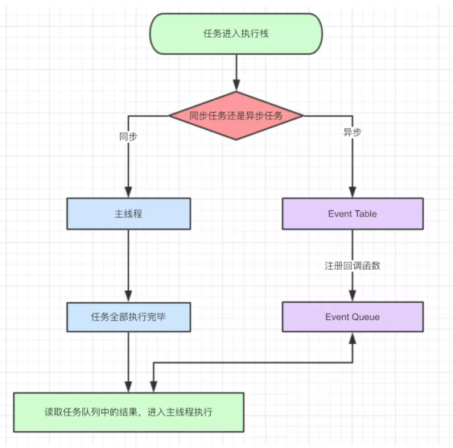
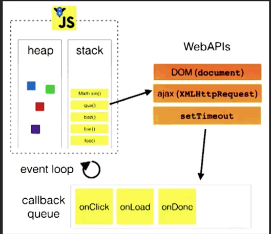
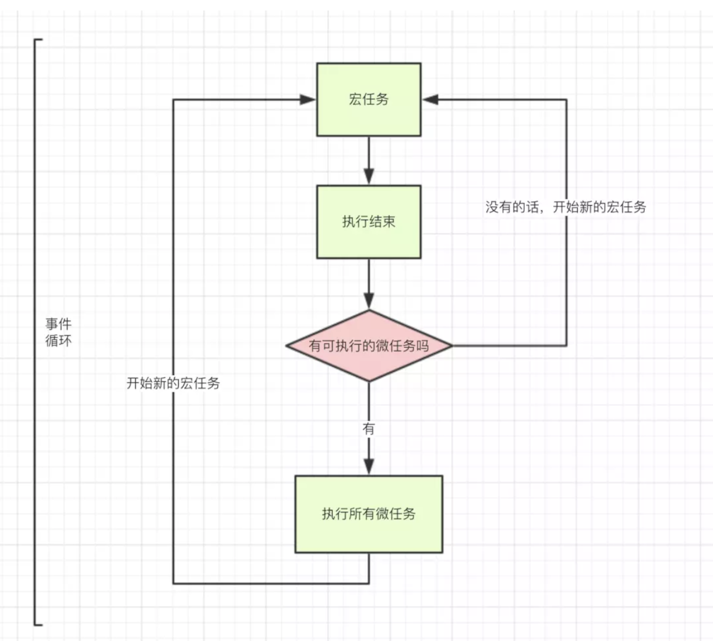
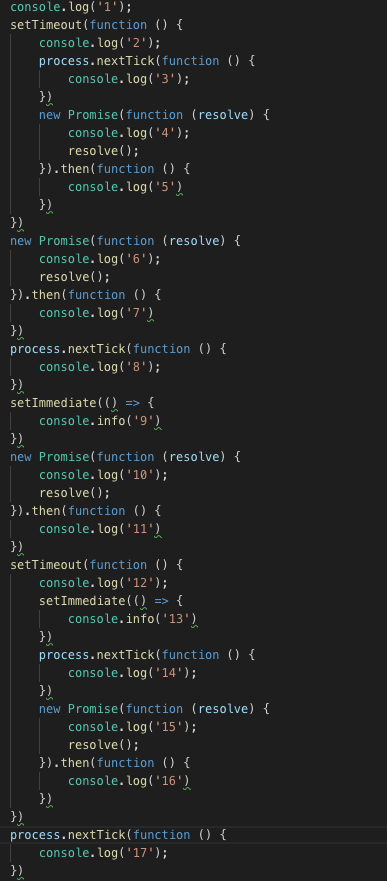
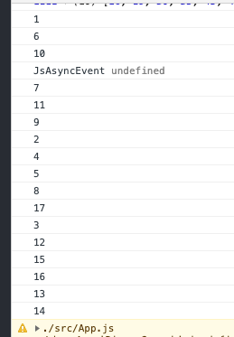
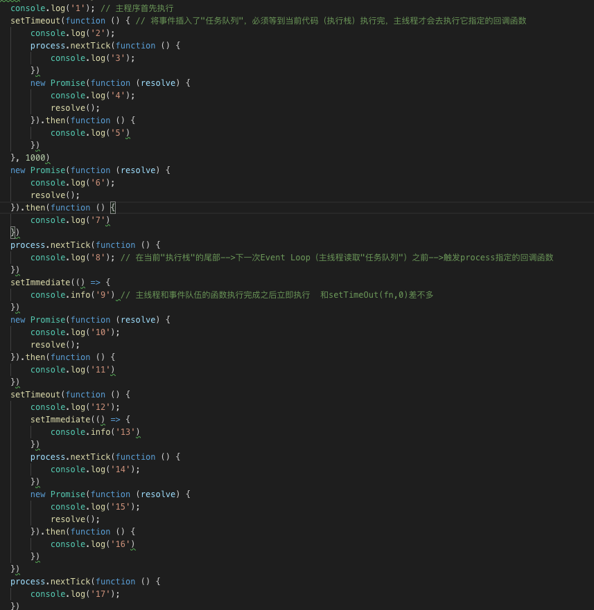
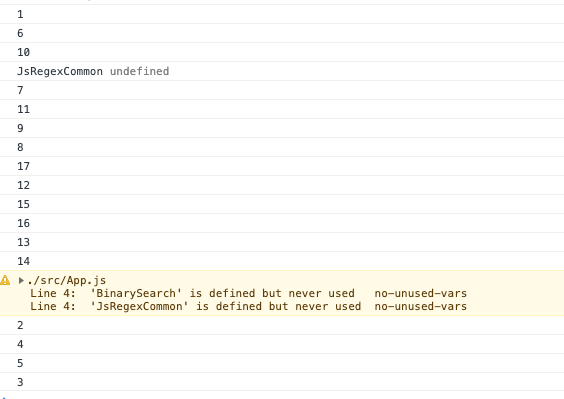
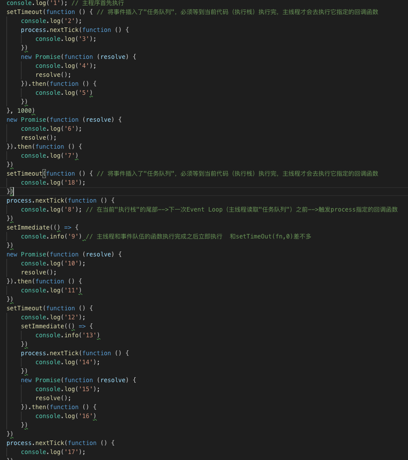
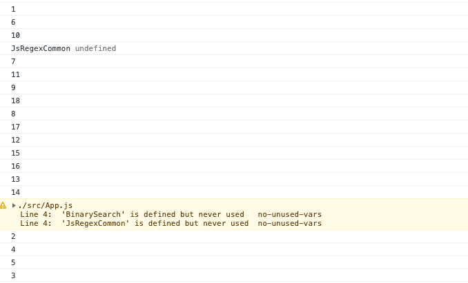

<Boxx  changeTime="5000"/>  

## 一、 首先，国内外专家理解

宏任务：script(主程序代码) setTimeOut setInterVal setImmediate  I/O操作  UI渲染     requestAnimationFrame

微任务：promise（原生） MutationObserver process.nextTick() mutation Object.observe

script(主程序代码)—>process.nextTick—>Promises…——>setTimeout——>setInterval——>setImmediate——> I/O——>UI rendering

补充 I/O： （懂得人直接跳过） mouse clicks 、keypresses、network events

js 内部执行机制：如下图


最经典的图如下：



先思考一个问题 setTimeout(fn,0) 这样的代码，0秒后立即执行？😁，你太天真了！

setTimeout(fn,0)的含义是，指定某个任务在主线程最早可得的空闲时间执行，意思就是不用再等多少秒了，只要主线程执行栈内的同步任务全部执行完成，栈为空就马上执行。

事件循环、宏任务、微任务关系如下：



* ## 二、 接着，总结

有如下代码：

```javascript
console.log('1');// 主程序首先执行
    setTimeout(function () { // 将事件插入了"任务队列"，必须等到当前代码（执行栈）执行完，主线程才会去执行它指定的回调函数
        console.log('2');
        process.nextTick(function () {
            console.log('3');
        })
        new Promise(function (resolve) {
            console.log('4');
            resolve();
        }).then(function () {
            console.log('5')
        })
    })

    new Promise(function (resolve) {
        console.log('6');
        resolve();
    }).then(function () {
        console.log('7')
    })
    process.nextTick(function () {
        console.log('8'); // 在当前"执行栈"的尾部-->下一次Event Loop（主线程读取"任务队列"）之前-->触发process指定的回调函数
    })
    setImmediate(() => {
        console.info('9')  // 主线程和事件队伍的函数执行完成之后立即执行  和setTimeOut(fn,0)差不多
    })

    new Promise(function (resolve) {
        console.log('10');
        resolve();
    }).then(function () {
        console.log('11')
    })

    setTimeout(function () {
        console.log('12');
        setImmediate(() => {
            console.info('13')
        })
        process.nextTick(function () {
            console.log('14');
        })

        new Promise(function (resolve) {
            console.log('15');
            resolve();
        }).then(function () {
            console.log('16')
        })
    })

    process.nextTick(function () {
        console.log('17');
    })
```

图片如下：



输出的结果是：1、6、10、7、11、9、2、4、5、8、17、3、12、15、16、13、14



* 分析：
a. setTimeOut、process.nextTick、setImmediate、promise 的区别

setTimeOut   将事件插入了"任务队列"，必须等到当前代码（执行栈）执行完，主线程才会去执行它指定的回调函数;

process.nextTick  在当前"执行栈"的尾部-->下一次Event Loop（主线程读取"任务队列"）之前-->触发process指定的回调函数

setImmediate  主线程和事件队伍的函数执行完成之后立即执行 和setTimeOut(fn,0)差不多

b. 

第一步. script整体代码被执行，执行过程为

a. 首先，执行script, console.log(1)

b. 创建setTimeout macro-task,  由于是setTimeOut(fn,0),所有放在当前“执行栈”的尾部，默认是0.4毫秒

c. 创建micro-task Promise.then 的回调，并执console.log(6), 

d. process.nextTick 创建micro-task,在当前"执行栈"的尾部-->下一次Event Loop（主线程读取"任务队列"）之前-->触发process指定的回调函数

e. 创建setImmediate macro-task,主线程和事件队伍的函数执行完成后立即执行

f. 创建micro-task Promise.then 的回调，并执console.log(10), 

g. 创建setTimeout macro-task,  由于是setTimeOut(fn,0),所有放在当前“执行栈”的尾部，默认是0.4毫秒

h. process.nextTick 创建micro-task,在当前"执行栈"的尾部-->下一次Event Loop（主线程读取"任务队列"）之前-->触发process指定的回调函数

第一个过程过后，已经输出了1 6 10 , 查看micro-task 并执行回调，输出 7，11，同步执行 setImmediate 输出9 ->1 6 10 7 11 9

此时第一个执行过程执行完，执行setTimeOut(fn,0)，输出：2 4 5 ，里面包含了一个process.nextTick，放在当前“执行栈”的尾部，执行 之前的process.nextTick（d、h）,  输出：8 17 ，再输出：3

再下一个事件循环，输出 12 15 16 13 14

总体输出为：   1 6 10 7 11 9 2 4 5 8 17 3 12 15 16 13 14

思考：
如果把第一个setTimeout（b）改成setTimeOut(fn,1000)，如下：



输出结果为：1 6 10 7 11 9 8 17 12 15 16 13 14 2 4 5 3 




这里可以思考，为什么process.nextTick（8 17）在  g. 创建setTimeout macro-task,之前？

再考虑如下：




输出如下:




在process.nextTick 前面加了一个事件：setTimeout(function () {   console.log('18')；    })，输出是 18 在 8 之前，

* 得出结论：
js 主程序 执行完-> 微任务（全部执行）->setImmediate->(setTimeOut(fu,0)与process.nextTick，那个在前面就先执行谁，完成一个事件循环)->再到下一个事件循环

* ## 三、 推荐的官方文档

[Tasks, microtasks, queues and schedules](https://jakearchibald.com/2015/tasks-microtasks-queues-and-schedules/?utm_source=html5weekly)

[深入理解js事件循环机制](http://lynnelv.github.io/js-event-loop-nodejs)

[Event Loop 必知必会](https://zhuanlan.zhihu.com/p/34182184)

[详解JavaScript中的Event Loop](https://zhuanlan.zhihu.com/p/33058983)

[Understanding JS: The Event Loop](https://link.juejin.im/?target=https%3A%2F%2Fhackernoon.com%2Funderstanding-js-the-event-loop-959beae3ac40)

[理解 Node.js 里的 process.nextTick()](https://link.juejin.im/?target=https%3A%2F%2Fwww.oschina.net%2Ftranslate%2Funderstanding-process-next-tick)

[Living Standard — Last Updated 2 September 2020](https://link.juejin.im/?target=https%3A%2F%2Fhtml.spec.whatwg.org%2Fmultipage%2Fwebappapis.html)

[The Node.js Event Loop, Timers, and process.nextTick()](https://link.juejin.im/?target=https%3A%2F%2Fnodejs.org%2Fen%2Fdocs%2Fguides%2Fevent-loop-timers-and-nexttick)

[window.requestAnimationFrame](https://link.juejin.im/?target=https%3A%2F%2Fdeveloper.mozilla.org%2Fzh-CN%2Fdocs%2FWeb%2FAPI%2FWindow%2FrequestAnimationFrame)

[MutationObserver](https://link.juejin.im/?target=https%3A%2F%2Fdeveloper.mozilla.org%2Fen-US%2Fdocs%2FWeb%2FAPI%2FMutationObserver)
