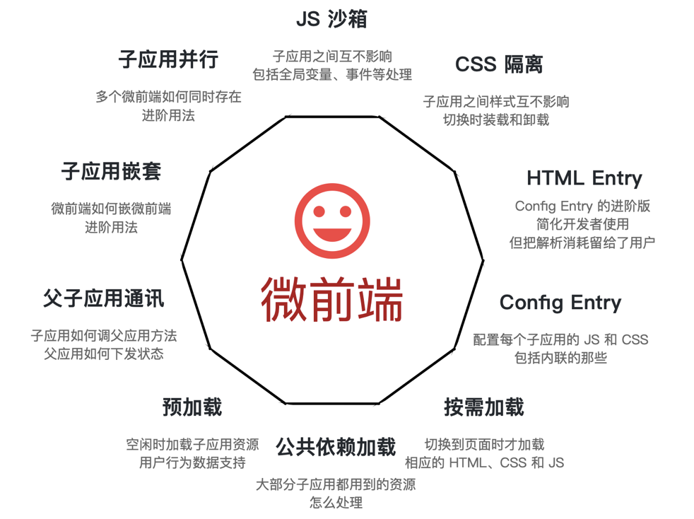

<Boxx  changeTime="5000"/>  

## 一. 背景

* Module Federation `[ˌfedəˈreɪʃn]` 使 JavaScript 应用得以在客户端或服务器上**动态**运行**另一个 bundle 的代码**。

```js
Multiple separate builds should form a single application. These separate builds should not have dependencies between each other, so they can be developed and deployed individually.

This is often known as Micro-Frontends, but is not limited to that.
```

* 翻译过来:

```js
多个独立的构建可以形成一个应用程序。这些独立的构建不会相互依赖，因此可以单独开发和部署它们。
这通常被称为微前端，但并不仅限于此。
```

## 二. 价值

* 场景



## 三. 实践

```js
...
const HtmlWebpackPlugin = require("html-webpack-plugin");
const ModuleFederationPlugin = require("webpack/lib/container/ModuleFederationPlugin");

module.exports = {
  // 其他webpack配置...
  plugins: [
    new ModuleFederationPlugin({
        name: 'empBase',
        library: { type: 'var', name: 'empBase' },
        filename: 'emp.js',
        remotes: {
          app_two: "app_two_remote",
          app_three: "app_three_remote"
        },
        exposes: {
          './Component1': 'src/components/Component1',
          './Component2': 'src/components/Component2',
        },
        shared: ["react", "react-dom","react-router-dom"]
      })
  ]
}
...
```

* 初步认识需要配置的属性:

| 字段名   | 类型   | 含义                                                                   |
|----------|--------|------------------------------------------------------------------------|
| name     | string | 必传值，即输出的模块名，被远程引用时路径为`${name}/${expose}`          |
| library  | object | 声明全局变量的方式，name为umd的name                                    |
| filename | string | 构建输出的文件名                                                       |
| remotes  | object | 远程引用的应用名及其别名的映射，使用时以key值作为name                  |
| exposes  | object | 被远程引用时可暴露的资源路径及其别名                                   |
| shared   | object | 与其他应用之间可以共享的第三方依赖，使你的代码中不用重复加载同一份依赖 |

## 四. 构建过程

* 让我们看看构建后的代码：

```js
var moduleMap = {
 "./components/Comonpnent1": function() {
  return Promise.all([__webpack_require__.e("webpack_sharing_consume_default_react_react"), __webpack_require__.e("src_components_Close_index_tsx")]).then(function() { return function() { return (__webpack_require__(16499)); }; });
 },
};
var get = function(module, getScope) {
 __webpack_require__.R = getScope;
 getScope = (
  __webpack_require__.o(moduleMap, module)
   ? moduleMap[module]()
   : Promise.resolve().then(function() {
    throw new Error('Module "' + module + '" does not exist in container.');
   })
 );
 __webpack_require__.R = undefined;
 return getScope;
};
var init = function(shareScope, initScope) {
 if (!__webpack_require__.S) return;
 var oldScope = __webpack_require__.S["default"];
 var name = "default"
 if(oldScope && oldScope !== shareScope) throw new Error("Container initialization failed as it has already been initialized with a different share scope");
 __webpack_require__.S[name] = shareScope;
 return __webpack_require__.I(name, initScope);
}
```

可以看到，代码中包括三个部分：

* **moduleMap**：通过exposes生成的模块集合
* **get**: host通过该函数，可以拿到remote中的组件
* **init**：host通过该函数将依赖注入remote中

再看moduleMap，返回对应组件前，先通过__webpack_require__.e加载了其对应的依赖，让我们看看__webpack_require__.e做了什么:

```js
__webpack_require__.f = {};
// This file contains only the entry chunk.
// The chunk loading function for additional chunks
__webpack_require__.e = function(chunkId) {
    // 获取__webpack_require__.f中的依赖
  return Promise.all(Object.keys(__webpack_require__.f).reduce(function(promises, key) {
    __webpack_require__.f[key](chunkId, promises);
  return promises;
 }, []));
};
__webpack_require__.f.consumes = function(chunkId, promises) {
// 检查当前需要加载的chunk是否是在配置项中被声明为shared共享资源，如果在__webpack_require__.O上能找到对应资源，则直接使用，不再去请求资源
 if(__webpack_require__.o(chunkMapping, chunkId)) {
  chunkMapping[chunkId].forEach(function(id) {
   if(__webpack_require__.o(installedModules, id)) return promises.push(installedModules[id]);
   var onFactory = function(factory) {
    installedModules[id] = 0;
    __webpack_modules__[id] = function(module) {
     delete __webpack_module_cache__[id];
     module.exports = factory();
    }
   };
   try {
    var promise = moduleToHandlerMapping[id]();
    if(promise.then) {
     promises.push(installedModules[id] = promise.then(onFactory).catch(onError));
    } else onFactory(promise);
   } catch(e) { onError(e); }
  });
 }
}
```

通读核心代码之后，可以得到如下总结：

* 首先，mf会让webpack以`filename`作为文件名生成文件
* 其次，文件中以var的形式暴露了一个名为`name`的全局变量，其中包含了`exposes`以及`shared`中配置的内容
* 最后，作为`host`时，先通过`remote`的`init`方法将自身`shared`写入`remote`中，再通过`get`获取`remote`中`expose`的组件，而作为`remote`时，判断`host`中是否有可用的共享依赖，若有，则加载`host`的这部分依赖，若无，则加载自身依赖。

## 推荐的官方文档

[module Federation原理学习](https://github.com/efoxTeam/emp/wiki/%E3%80%8Amodule-Federation%E5%8E%9F%E7%90%86%E5%AD%A6%E4%B9%A0%E3%80%8B)
