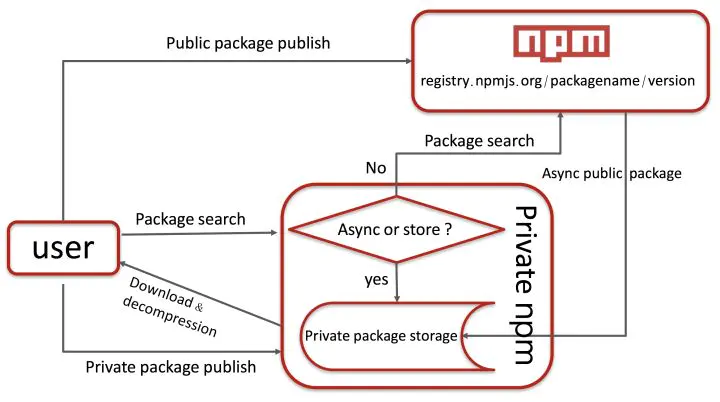

<Boxx  changeTime="5000"/>  

## 使用verdaccio搭建私有npm仓库

### 当前npm 私有仓库有以下包：
[私有仓库地址](http://pri-npm.atag.common.com.cn/)

|                包名                |                    说明                     |    备注    |
|:----------------------------------:|:-------------------------------------------:|:----------:|
| @common/bs-common-element-web-code |         基于webpack的单页面web app          | 版本v0.1.4 |
|       @common/bs-common-util       |                通用js工具类                 | 版本v1.2.3 |
|      @common/bs-js-to-native       |               js与native通信                | 版本v1.0.3 |
|        @common/bs-common-ui        |     基于uView UI,适配不同终端的解决方案     | 版本v1.0.8 |
|     @common/bs-common-ui-next      | 基于uView UI,适配不同终端的解决方案(vue3.x) | 版本v1.0.4 |

## 一、为何选择

选择背景：

* 1.使用cnpmjs.org,这个要搭建数据库，较麻烦。

* 2.Sinopia多年未更新，Verdaccio是基于Sinopia重构的，注入了更多活力

* 3.Verdaccio是一个零配置的私有的带缓存功能的npm包管理工具

这里简单使用[verdaccio](https://github.com/verdaccio/verdaccio)。

## 二、工作原理



## 三、安装流程


## 四、环境搭建

```javascript
node + npm + verdaccio + pm2 + nrm
```

1.安装：npm install -g verdaccio

2.verdaccio配置：
全局安装verdaccio的目录在node下面，/lib/node_modules/verdaccio,我们要修改的配置在~/.config/verdaccio/config.yaml,这个文件其实是复制刚才的全局安装下的config文件夹下的default.yaml的。

3.启动verdaccio：

4.浏览器打开: (http://localhost:4873/)


* 可借助工具pm2来进行管理

```javascript
npm install -g pm2 // pm2安装
pm2 start which verdaccio // 启动verdaccio
pm2 stop which verdaccio // 停止服务
pm2 show verdaccio // 查看verdaccio进程实时日志
```

5.nrm管理镜像：

```javascript
npm install -g nrm  // 安装nrm
nrm ls  // 查看镜像列表
nrm add xxx "your address" // 添加账号
npm adduser --registry http://xxxxx // 注册账号
nrm use xxx      //  使用npm源
```

## 五、有何价值

* 1.安全性角度考虑:如果我们想要一个公共组件库，那么把组件放到我们私有库中，只有内网可以访问，这样可以避免组件中业务的泄露；
* 2.模块复用性角度考虑：多个项目之间有重复的共有模块，当需要修改模块，通过简单的统一的配置就可以实现；提炼后的组件有专门的地址可以用来查看，方便使用，在后期项目的引用中也能节约开发成本
* 3.npm包下载速度角度考虑：使用内部的地址，能够在开发下载node包的同时，将关联的依赖包缓存到verdaccio服务器中，下载速度更快；
* 4.项目开发中的路径角度考虑：在项目开发中书写代码更整洁简练，不需书写更长的相对路径；
* 5.公司技术沉淀角度考虑：知识的沉淀，在公司业务相关的应用上尤佳；
* 6.版本角度的考虑：相当于一个容器，统一管理需要的包，保持版本的唯一；
* 7.开发效率角度考虑：使私有公共业务或组件模块能以共有包一样的管理组织方式，保持一致性，提高开发效率；

## 六、使用规则

* 1.在git上新建一个私有仓库组common-xx，本质是为了避免和外来node包冲突
* 2.然后再在common-xx中新建私有项目，比如bs-common-element-web-code
* 3.版本问题【尽可能兼容低版本，未兼容部分，需要告知为什么不能实现】
* 4.限制发布者权限、对common-xx中的项目进行命名审核，以及更新迭代代码的审核
* 5.所有的发布私有包，必须走git流程，不能私底下违规发布
* 6.还在完善中……

## 七、实战截图

* 1、git上面的地址---智慧健康通-通用（element ui）-底层架构: [gitlab - 源码](https://jkcs.common.com.cn/bs-standard-repo/fore-end/bs-common-element-web-code)

如下图：


* 2、git clone 上面的git地址，并进行utils私有库项目的开发

如下图：


* 3、npm publish

如下图：


* 4、npm unpublish xxx --force (切记：不要顺便删除线上的包)

如下图：


* 5、站点展示

如下图：


* 6、食用：npm i common-xx

如下图：


* 7、storage 放在那里的？

1)、命令行中输入：verdaccio ，

2)、找到config file  中/Users/sweet/.config/verdaccio/config.yaml

3)、vim 打开 config.yaml, 部署的文件放在：'/Users/sweet/.local/share/verdaccio/storage'


## 推荐的官方文档

[verdaccio搭建npm简单实践](https://www.jianshu.com/p/70741a7dd587)

[基于verdaccio的npm私有仓库搭建和使用总结](https://www.jianshu.com/p/16b0a2f124fb)

[npm私有库服务搭建及规范定制](https://juejin.im/post/6844903742161027085)

[Verdaccio 搭建私有 NPM](https://juejin.im/post/6844903833819152391)

[使用verdaccio搭建私有npm](https://juejin.im/post/6844903961346965517)
