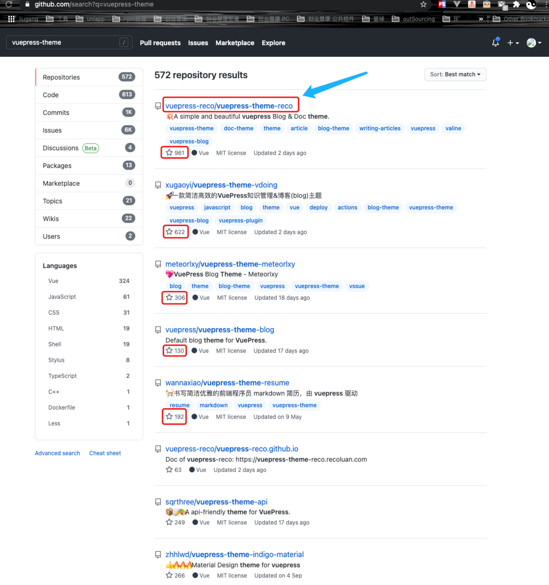

<Boxx  changeTime="5000"/>  

## 一. 搭建文档

* yarn add -D vuepress # npm install -D vuepress

## 二. 引入主题

[vuepress-theme-reco](https://vuepress-theme-reco.recoluan.com/)

* 为什么选择？



## 三. 引入插件

```js
module.exports = {
  theme: 'reco',
  themeConfig: {
    valineConfig: {
      appId: '...',// your appId
      appKey: '...', // your appKey
    }
  }  
}
```

## 四. 快速食用

* 见本文档
