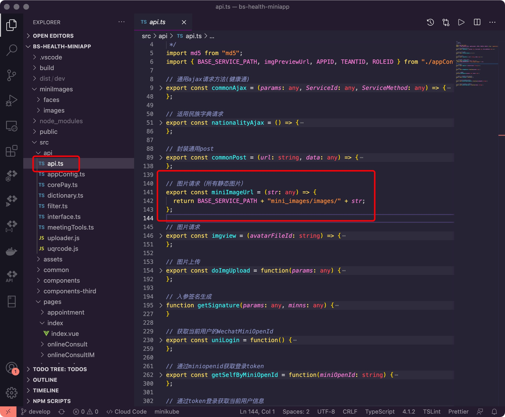
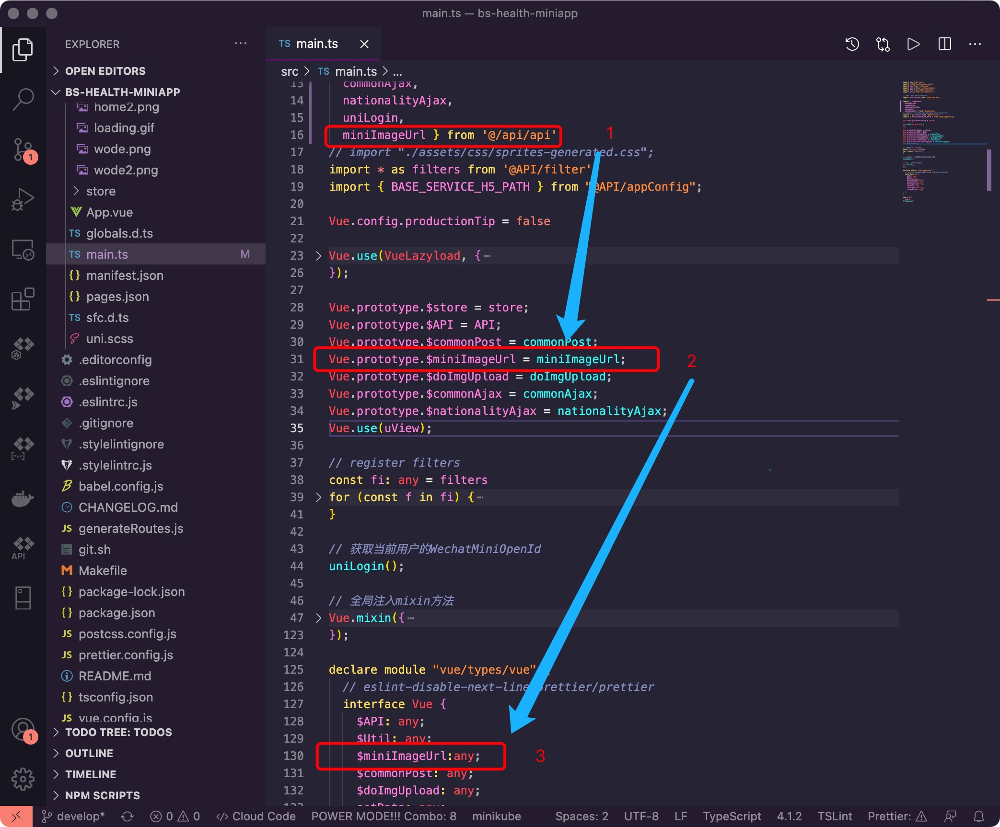
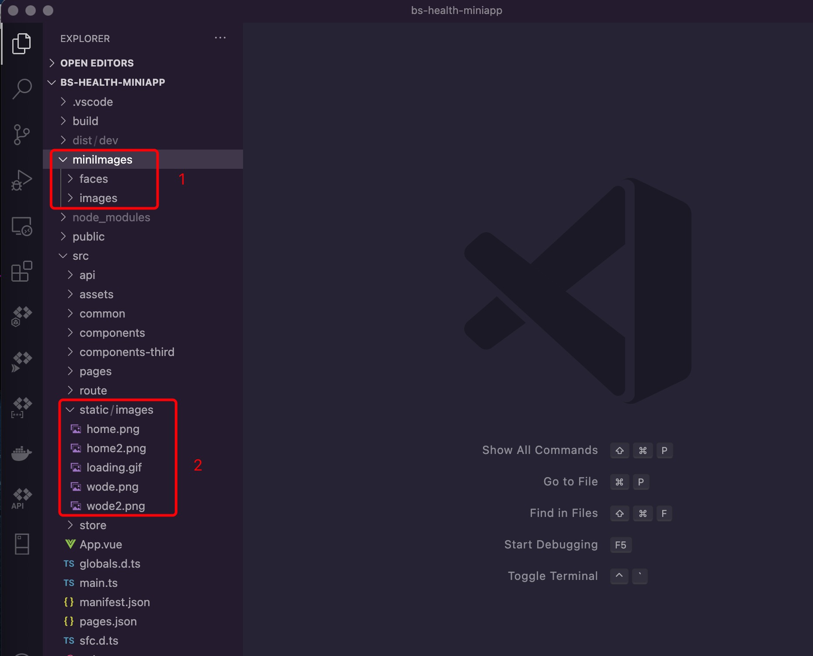
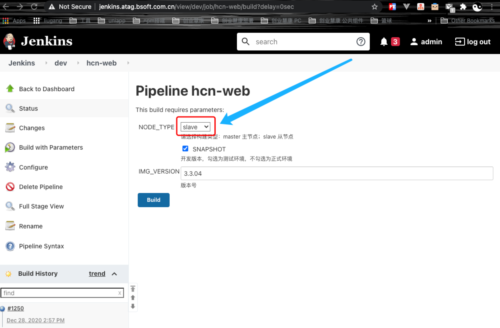
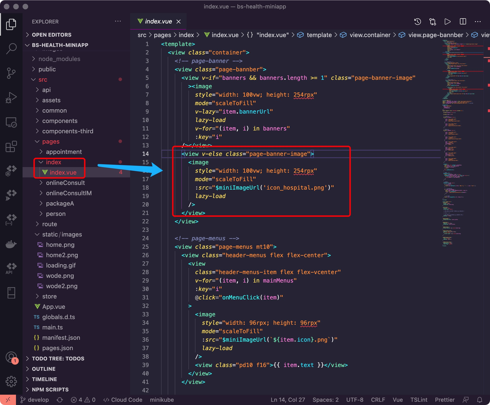

<Boxx  changeTime="5000"/>  

## 1. 如何配置

* 在src/api/appConfig.ts里面配置

```javascript
...
// xxx
export const BASE_SERVICE_PATH = "xxxxxx/hcn-web/";
...
```

* 并在src/api/api.ts里面加入：

```javascript
...
// 图片请求（所有静态图片）
export const miniImageUrl = (str: any) => {
  return BASE_SERVICE_PATH + "mini_images/images/" + str;
};
...
```

* 如下图：


* 在main.ts里面配置全局$miniImageUrl

```javascript
...
import {miniImageUrl } from '@/api/api';
...
Vue.prototype.$miniImageUrl = miniImageUrl;
...
...
declare module "vue/types/vue" {
  // eslint-disable-next-line prettier/prettier
  interface Vue {
    ...
    $miniImageUrl:any;
    ...
  }
}
...
```

* 如下图：


## 2. 发布图片



* 2.1 项目结构里面的miniImage文件是与放入后台的文件一样层级;

* 2.2 如果有新图片，都放入miniImages文件下的images里面;

* 2.3 上传图片

* 2.3.1 将文件miniImages压缩发给相对应的后台;

* 2.3.2 同时也可以自己上传：

```javascript
* a、git clone -b develop http://jkcs.common.com.cn/hc/service/hcn-web.git
* b、cd hcn-web\web\mini_images，放入相应的图片
* c、jenkins(hcn-web) 构建选择slave / rancher(hcn-web-slave-3-3-04)
```

* jenkins选择如下图：



* 2.4 发布好，就可以使用站点地址;

* 2.5 本地不会打包miniImages资源，这里图片只是方便开发人员更新和查看用的;

* 2.6 特别注意，src/static/images里面仅能存放项目必须要静态的资源，其他非必须的资源都放入站点，然后再引入。

## 3. 引入图片

配置好后，任意模块，引入图片，非常方便。

```javascript
...
<image
  style="width: 100vw; height: 254rpx"
  mode="scaleToFill"
  :src="$miniImageUrl('icon_hospital.png')"
  lazy-load
/>
...
```

### 具体操作，如下图：



## 4. 图片优化

* 加入loading和error错误展示图片，
* 建议都用u-image组件，不直接用image组件，这样提升用户体验

```javascript
<u-image
  width="160"
  height="120"
  border-radius="12"
  :lazy-load="true"
  :src="xxx"
  >
    <u-loading slot="loading"></u-loading>
    <image
      style="background-color: #fff"
      slot="error"
      mode="scaleToFill"
      :src="$miniImageUrl('icon_hospital.png')"
    />
</u-image>
```
