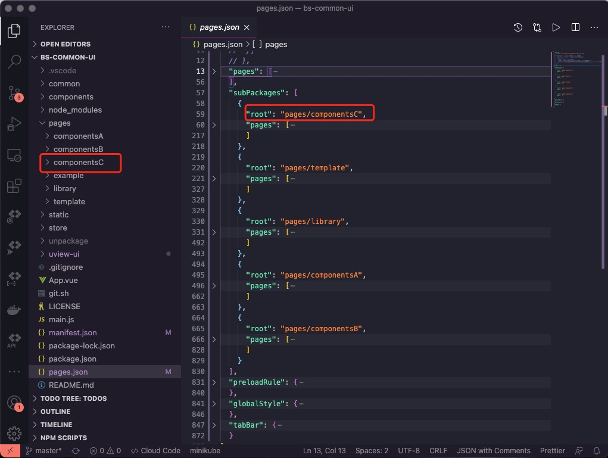

<Boxx  changeTime="5000"/>  

## 一、分包策略

### 1.1 路由内增加

 isSubPackage 当前页面是否分包
 subPackageRoot  分包路径配置

 demo

 ``` bash
  {
    path: "onlineConsult/meeting",
    style: {
      navigationBarTitleText: "进入视频",
    },
    isSubPackage: true,
    subPackageRoot: "pages/onlineConsultIM",
  },

  设置好运行yarn g，重新生成pages.json
  ```

### 1.2 策略的由来

* 根据官网和uview代码目录结构如下：

#### 官网源码


#### uview源码



* 分析得出：在pages下面的页面基本不用移动，策略放入route里面进行

* 解决方案如下：

 ``` bash
 {
    path: "onlineConsult/meeting",
    style: {
      navigationBarTitleText: "进入视频",
    },
    isSubPackage: true,
    subPackageRoot: "pages/onlineConsultIM",
  },
  ```

  ``` bash
  {
    path: "index",
    style: {
      navigationBarTitleText: "预约挂号",
    },
    isSubPackage: true,
    subPackageRoot: "pages/appointment",
  },
  ```

* pages下面根据实际情况，进行分包，命名可以为:packageA 等


* 需要在route/index.ts 里面把相关注释标注好,这样方便查找并进行尺寸大小的计算


## 二、 如何优化性能

* 打包优化：
目前前端使用的uniapp 比较火，毕竟基于Vue，上手快成本低，还能兼容APP、h5、和小程序，但是随着项目的开发迭代，项目越来越大。

我们肯定首先想到的便是分包，但是后来发现治标不治本，主包还是很大，于是便对打包后的文件逐一排查

### 2.1 首先进入微信打包文件

```javascript
cd dist/dev/mp-weixin
```

### 2.2 审查文件大小

#### 2.2.1 mac 查看

```javascript
du -h *
```

#### 2.2.2 windows 查看

* 站点上资源
[windows某个目录下所有文件/文件夹的大小](http://t.zoukankan.com/gered-p-10208281.html)

* 实践之后如下图:


### 2.3 发现

* 发现每个 wxss 文件都很大，打开发现每个wxss文件都有重复的公共css，而这些css 都是放到根目录uni.scss文件里的

* 特别注意：


* 分析：1+2+3 , 3个包将近150k,其实bs-common-ui有类似的组件，完全可以进行替换；
* 总结：bs-common-ui有类似的组件，就不用再写业务组件，除非当前业务没有办法满足，必须要写一个。

### 2.4 解决

知道问题所在就好办了，uni.scss 里面变量可以保留，而其他的css 都放到app.vue里面就可以了

* 总结：
* 1、减少页面级渲染
* 2、能用CSS解决的，不要用JS
* 3、减少M级图片，在保证分辨率的同时，尽量压缩图片
* 4、减少包的体积，去掉不必要的图片，字体文件备份文件等

## 推荐的官方文档

[给小程序再减重 30% 的秘密​（京喜小程序首页瘦身实践）](https://mp.weixin.qq.com/s/wOGMqir2FHejq78MaZGuiA)

[CSS Modules](https://github.com/css-modules/css-modules)

[Tree-Cli](https://github.com/MrRaindrop/tree-cli)

[小程序工程化探索](https://mp.weixin.qq.com/s/_NSJTQ-4-8gTnwTVK-tn0A)

[微信小程序 限制 2M 的瘦身技巧与方法详解](https://blog.csdn.net/wlanye/article/details/73457700)
