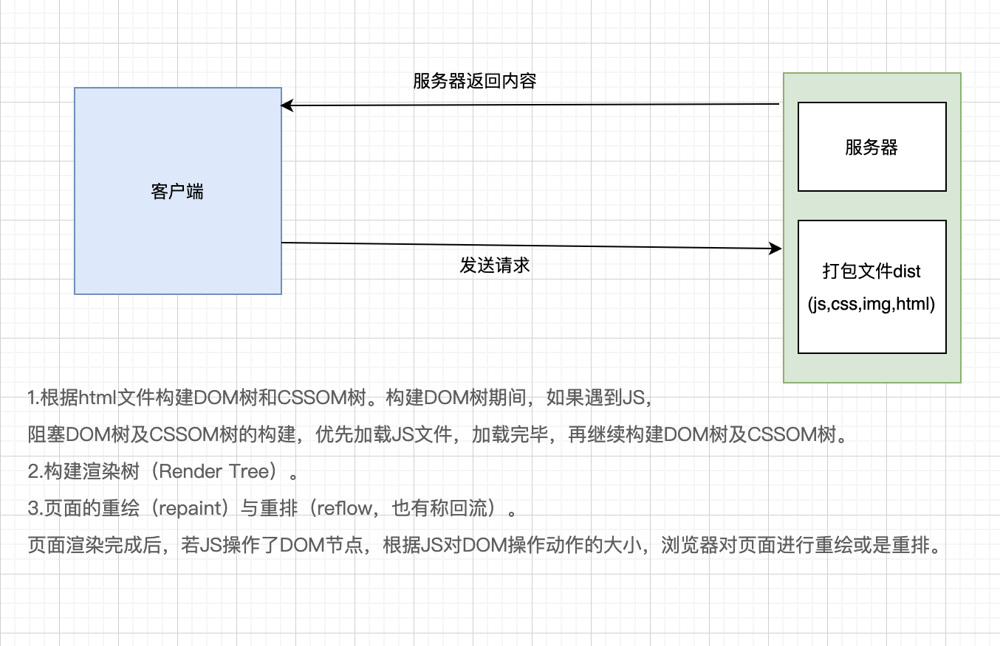
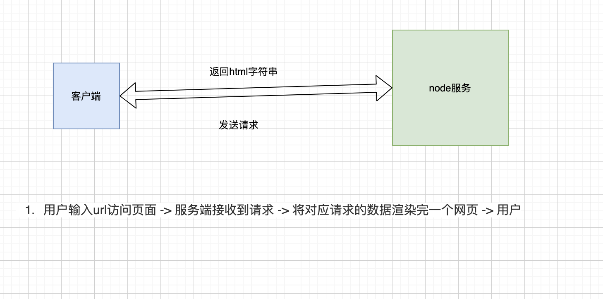
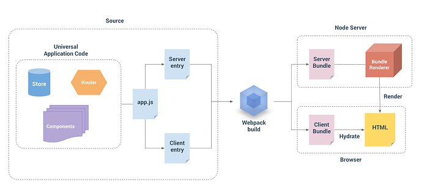
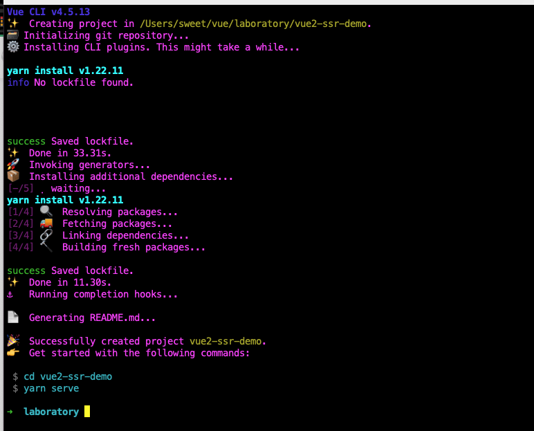
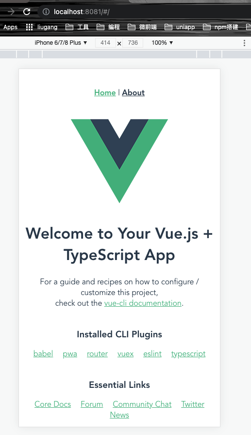
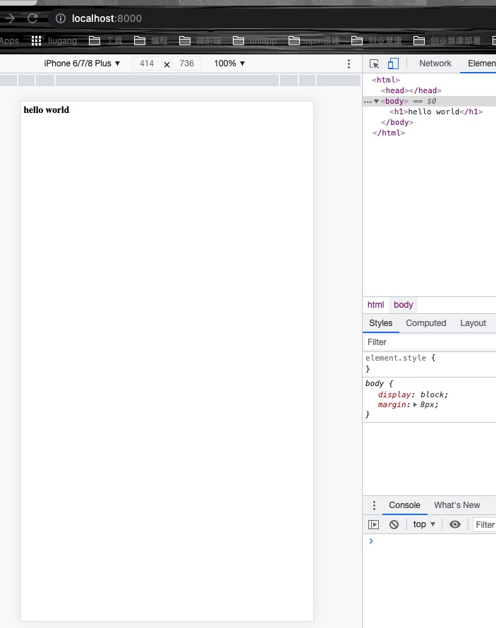
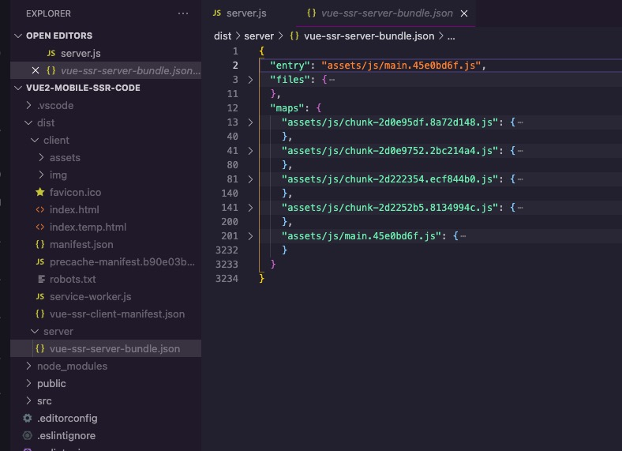
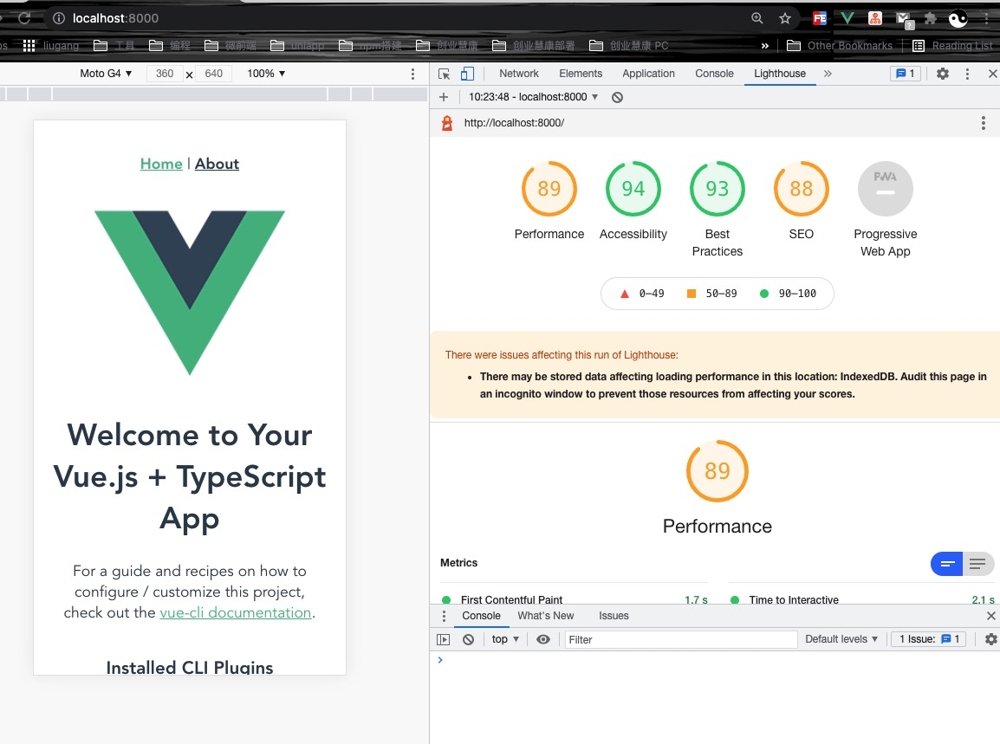
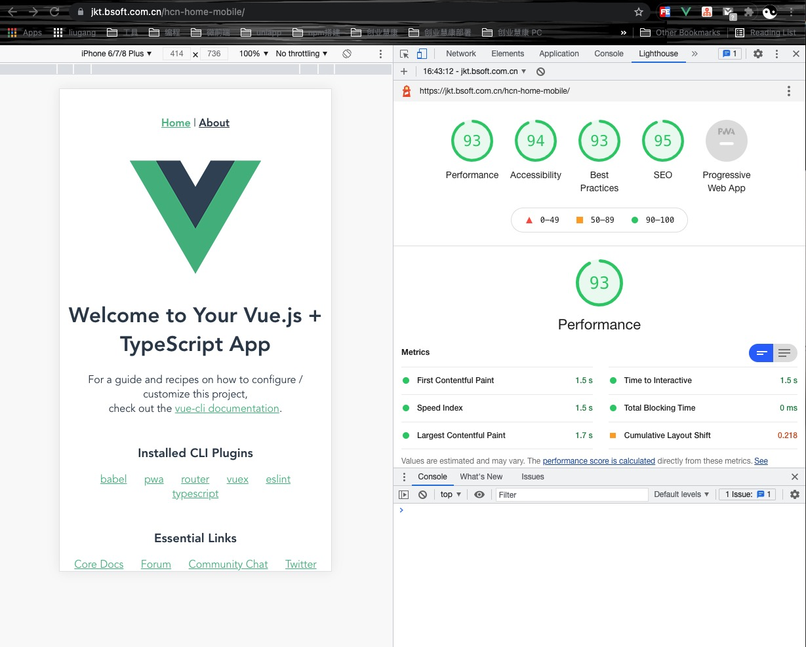

<Boxx  changeTime="5000"/>  

## 总方针：是什么？从哪里来？要到哪里去？

[ 注意: 下面的说明仅供参考,会由于项目变更而发生变化,请随时保持沟通! ]()

[gitlab - 源码](https://jkcs.common.com.cn/learning/h5/vue2-ssr-mobile-code)

### 一、传统 vs ssr

1.1 传统的vue项目浏览器渲染模式



* 缺点：
- 1. SEO问题
- 2. 首页渲染速度
- 3. 消耗性能问题

1.2 服务端渲染模式

粗略的图为：


细致的图为：


* 优点：
- 1. 更好的 SEO，由于搜索引擎爬虫抓取工具可以直接查看完全渲染的页面
- 2. 首屏渲染速度快

## 二、ssr 原理

步骤1. 使用vue-cli4搭建一个新项目：
命令行输入：vue create vue2-ssr-demo

搭建完成：



本地跑项目：



步骤2. 开始改造，创建server.js （node）

```js
// nodejs 服务器
const express = require("express");
const Vue = require("vue");
const fs = require("fs");

// 创建 express 与vue 实例
const app = express();

// 路由的处理交给vue
app.get("/", async (req, res) => {
  try {
    const page = "<h1>hello world</h1>";
    res.send(page);
  } catch (error) {
    res.status(500).send("服务器内部错误");
  }
});

const port = 8000;

app.listen(port, () => {
  console.log(`渲染服务器启动成功！查看：localhost:${port}`);
});
```

查看： http://localhost:8000/


上面👆 出现hello world 则说明express创建的node服务器成功了


步骤三. 改造 router

```js
// 原来的写法
// const router = new VueRouter({
//   mode: 'history',
//   base: process.env.BASE_URL,
//   routes
// })
//
// export default router

// 修改后的写法
export default function createRouter() {
  return new VueRouter({
    mode: "history",  // 一定要history 
    base: process.env.BASE_URL,
    routes,
  });
}
```

步骤四. 改造 main.ts

```js
// 原来的写法
// new Vue({
//   router,
//   store,
//   render: h => h(App)
// }).$mount('#app')

// 修改后的写法
export function createApp() {
  // 创建 router 
  const router = createRouter();
  const app = new Vue({
    router,
    render: (h) => h(App),
  });
  return { app, router };
}
```

步骤五. 创建 entry-client.js

```js
// 挂载激活app
import createApp from "./main";

const { app, router } = createApp();
router.onReady(() => {
  app.$mount("#app");
});

```

步骤六. 创建 entry-server.js

```js
// 渲染首屏幕
import createApp from "./main";

export default (context) => {
  return new Promise((resolve, reject) => {
    const { app, router } = createApp();
    // 进入首屏
    router.push(context.url);
    router.onReady(() => {
      resolve(app);
    }, reject);
  });
};
```

步骤七. 创建 vue.config.js

```js
const path = require("path");
const VueSSRServerPlugin = require("vue-server-renderer/server-plugin");
const VueSSRClientPlugin = require("vue-server-renderer/client-plugin");
const nodeExternals = require("webpack-node-externals");
const merge = require("lodash.merge");
const TARGET_NODE = process.env.WEBPACK_TARGET === "node";
const target = TARGET_NODE ? "server" : "client";

// common parse path
function resolve(dir) {
  return path.join(__dirname, "./", dir);
}

module.exports = {
  publicPath: "/hcn-home-mobile/",
  assetsDir: "assets",
  outputDir: "./dist/" + target,
  configureWebpack: () => ({
    entry: `./src/entry-${target}.js`,
    devtool: "source-map",
    target: TARGET_NODE ? "node" : "web",
    node: TARGET_NODE ? undefined : false,
    output: {
      libraryTarget: TARGET_NODE ? "commonjs2" : undefined,
    },
    externals: TARGET_NODE
      ? nodeExternals({
          allowlist: [/\.css$/, /vant\/lib/],
        })
      : undefined,
    optimization: {
      splitChunks: TARGET_NODE ? false : undefined,
    },
    plugins: [TARGET_NODE ? new VueSSRServerPlugin() : new VueSSRClientPlugin()],
  }),
  chainWebpack: (config) => {
    // 配置别名  不配置会报错
    config.resolve.alias
      .set("@", resolve("src"))
      .set("@STA", resolve("static"))
      .set("@ASS", resolve("src/assets"))
      .set("@API", resolve("src/api"))
      .set("@COM", resolve("src/components"))
      .set("@VIE", resolve("src/views"));

    config.module
      .rule("vue")
      .use("vue-loader")
      .tap((options) => {
        merge(options, {
          optimizeSSR: false,
        });
      });
  },
  css: {
    extract: false,
    loaderOptions: {
      less: {
        modifyVars: {
          // 直接覆盖变量
          // 'tabs-default-color': 'blue',
          // 或者可以通过 less 文件覆盖（文件路径为绝对路径）
          hack: `true; @import "${path.join(__dirname, "./src/assets/css/theme.less")}"`,
        },
      },
    },
  },
  devServer: {
    open: true,
  },
};

```


步骤八. package.json 中 scripts修改

```js
"scripts": {
    "serve": "vue-cli-service serve",
    "lint": "vue-cli-service lint",
    "build:client": "vue-cli-service build",
    "build:server": "cross-env WEBPACK_TARGET=node vue-cli-service build --node server",
    "build": "npm run build:server && npm run build:client",
    "service": "node server.js"
  },
```


步骤九. 执行 npm run build



步骤十. 再次改造server.js


```js
// nodejs 服务器
const express = require("express");
const Vue = require("vue");
const fs = require("fs");
// 创建 express 与vue 实例
const app = express();

// 创建渲染实例
const { createBundleRenderer } = require("vue-server-renderer");

// 服务端bundle
const serverBundle = require("./dist/server/vue-ssr-server-bundle.json");

// 客户端清单
const clientManifest = require("./dist/client/vue-ssr-client-manifest.json");
const renderer = createBundleRenderer(serverBundle, {
  runInNewContext: false,
  template: fs.readFileSync("./public/index.temp.html", "utf-8"), // 宿主模版文件
  clientManifest,
});

// 中间件处理静态文件请求
app.use("/hcn-home-mobile", express.static("./dist/client"));

// 路由的处理交给vue
app.get("*", async (req, res) => {
  try {
    const context = { url: req.url, title: "ssr" };
    // nodejs流数据，文件太大，用renderToString会卡
    const stream = renderer.renderToStream(context);
    let buffer = [];
    stream.on("data", (chunk) => {
      buffer.push(chunk);
    });
    stream.on("end", () => {
      res.end(Buffer.concat(buffer));
    });
  } catch (error) {
    res.status(500).send("服务器内部错误");
  }
});

const port = 8080;

app.listen(port, () => {
  console.log(`渲染服务器启动成功！查看：localhost:${port}`);
});


```

步骤十一. 执行 nodemon server.js





步骤十一. 部署到站点：https://xxx.com.cn/hcn-home-mobile/





### 推荐的官方文档

- [基于vue-cli4.0 + ts +ssr](https://segmentfault.com/a/1190000022616414)

- [vue项目改造SSR（服务端渲染)](https://blog.csdn.net/wang15180138572/article/details/118549088?utm_medium=distribute.pc_relevant.none-task-blog-2%7Edefault%7ECTRLIST%7Edefault-8.no_search_link&depth_1-utm_source=distribute.pc_relevant.none-task-blog-2%7Edefault%7ECTRLIST%7Edefault-8.no_search_link)
