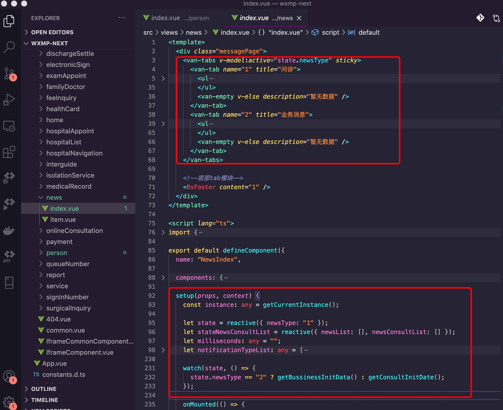
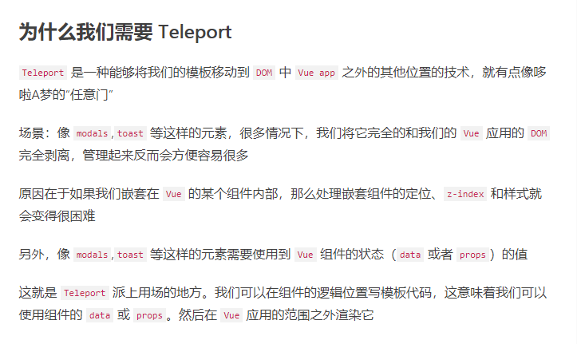

<Boxx  changeTime="5000"/>  

## 相关依赖

本工程是基于webpack的单页面web app(node:12+、 vue:3.0.0-0 、vuex:4.0.0-0 、vant: 3.0.0-beta.0、 webpack:4.44.1、ts:4.0.2)

[ 注意: 下面的说明仅供参考,会由于项目变更而发生变化,请随时保持沟通! ]()

[gitlab - 源码](http://jkcs.common.com.cn/bs-standard-repo/fore-end/wxmp-next)

## 一、Vue2 VS Vue3(API)

### 1. createApp

### 2. component

### 3. config

* devtools

* errorHandler

* warnHandler

* globalProperties（新增）

```javascript
// Vue2.x
Vue.prototype.$api = () => {}

// Vue3
const app = Vue.createApp({})
app.config.globalProperties.$api = () => {}

```

如何在模块里面使用？

```javascript
import { getCurrentInstance } from "vue";

...
setup(props, context: any) {
    const instance: any = getCurrentInstance();
    instance.proxy.$api.xxxx;
}
...

```

* filters 如何食用

```javascript
// 在main.ts文件里面
...
import * as filters from "./api/filters";
...
app.config.globalProperties.$filters = filters;
...

// 模块里面使用
<template>
...
<span>{{ $filters.filterLength(item.title,18) }}</span>
...
</template>
```

[ 总结：定义的全局变量，在js中食用：instance.proxy.xxx；在template里面食用：xxx(直接食用) ]()

* isCustomElement（新增）

* optionMergeStrategies

* performance

### 4. directive

### 5. mixin（基本一致）

### 6. mount（类似）

### 7. provide/inject（一致）

### 8. unmount（新增）

* 在所提供的DOM元素上卸载应用程序实例的根组件

```javascript
import { createApp } from 'vue'

const app = createApp({})
// 做一些必要的准备
app.mount('#my-component')

// 应用程序将在挂载后3秒被卸载
setTimeout(() => app.unmount('#my-component'), 3000)

```

### 9. use（一致）
* 用法基本一致

## 二、reactive 如何优雅地食用



* 如果使用了van-tabs，需要根据切换的tab，请求不同的接口，则要使用watch进行数据的监听。
* 其他template 需要响应式的数据都放入一个对象里面，进行数据双向绑定

## 三、组件 插槽

```javascript
// Vue2.x
<BsXXX title="我的XXX" isLink @click="XXX">
     <i slot="icon" class="w_icon w_icon_icon_mine_address2x"></i>
</BsXXX>

// Vue3
<BsXXX title="我的XXX" isLink @click="XXX">
      <template v-slot:icon>
        <i class="w_icon w_icon_icon_mine_address2x"></i>
      </template>
</BsXXX>
```

* 父组件插槽进行这样修改，子组件不变

## 四、teleport




## N. 参考文献

[Vue3文档【Vue2迁移Vue3】](https://juejin.im/post/6858558735695937544#heading-18)

[Vue3.0变动简介](https://juejin.im/post/6859541760797442062)

[从Vue 2到Vue 3的迁移指南之破坏性特性](https://juejin.im/post/6859427370080665613#a-note-for-plugin-authors)
